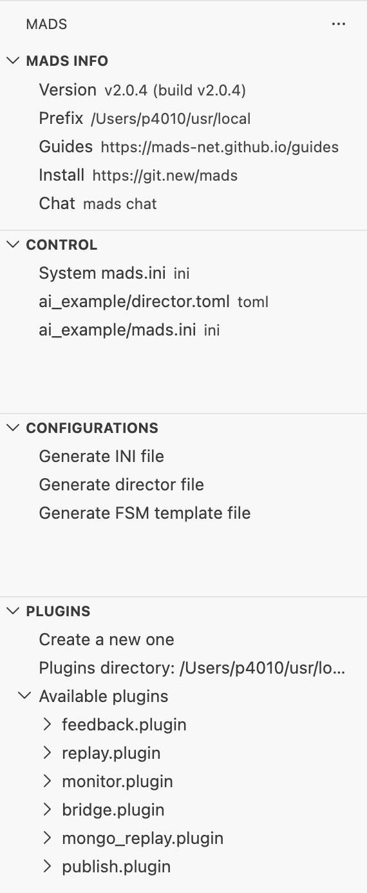

# Intro

MADS agents can be programmed in many different ways: in C++, using the [`python_agent`](https://github.com/MADS-Net/python_agent), writing your own python scripts that loads the [`Agent` library](/guides/python_agent.qmd), using R scripts and the [`r_plugin`](https://github.com/MADS-Net/r_plugin), and possibly other ways too. Regardless, C++ code always provides the best performances.

But even if you are not really proficient in C++, you can still create your own plugins by **properly** using some AI coding agents.

Hereafter we'll go through an example that creates a source agent that reads measurements from a serial port, and a filter agent that calculates some running statistics on the data provided by the source.

::: {.callout-note}
In the following we are using GPT-5.4, but you may as well use other modern, coding-oriented agents and get very similar results, still leveraging the same approach.

Whatever you are using, be sure to use a coding agent integrated with Visual Studio Code (or the editor you prefer), so it can have access to the files in your project. In visual Studio Code, this means either ChatGPT Codex extension, or the embedded Copilot module.
:::


## Serial port

Supppose that the serial-port connected device published data frames with the following format:

```
^<value1>,<value2>,...,<valueN>$
```

with a variable number of values in each frame, and a variable time interval between frames. The `^` and `$` characters are the start and end of frame markers, respectively.

Since we may connect to the device at any time, we may start reading in the middle of a frame, so we need to be able to handle partial frames and correctly reassemble them into complete frames.

## Running stats

We want to calculate the running mean and standard deviation of the values in the frames, with a sliding window of 100 frames and a stride of 50 frames. The stats should be published as a new topic every time a new stats package is available.


# Project setup

Create a new project folder and open it in VSCode. Be sure to have the extension installed. If not, simply open the terminal and type:

```sh
code --install-extension MADS-Net.madscode
```

:::aside
[](https://marketplace.visualstudio.com/items?itemName=MADS-Net.madscode){target="_blank"}
:::

Now in the MADS side panel under the section [plugins]{.bgray} select "Create a new one", select `source` as type and name it `serial`, then repeate the command, select `filter` as type and name it `stats`.

Open the `CMakeLists.txt` file and after the line `add_plugin(serial)` add a new line with:

```cmake
add_plugin(serial)
add_plugin(stats)
```

This way the cmake script can build and create both the source and the filter plugin at the same time, compiling `src/serial.cpp` and `src/stats.cpp`, respectively.

The MADS plugin library, which is fetched by CMake and available in `src/_deps/plugin-src`, contains a simple `SerialPort` C++ class. We are going to use it, so we can as well add

```c++
#include <serialport.hpp>
```

near the top of `src/serial.cpp`. This is going to be a hint for the AI assistant on how to deal with the serial ports.

# AI-assisted coding


## Preliminary notes

AI coding assistants are very powerful, but they are not perfect. As for all AI-based tools, they can **make mistakes**, and they can also be confused by ambiguous instructions. For this reason, it's important to be very **clear and specific** in your instructions, and to always **verify** the code they generate.

But when comparing coding assistants to other AI-based tools, we are in a field that has a big advantage: we can easily verify the code they generate by running it and checking if it works as expected. This is a huge advantage, because it allows us to quickly identify and fix any mistakes the assistant may have made. Even better: we can ask the assistant to go on and fix the code until it works as expected, which is a very powerful way to leverage the AI assistant's capabilities.

That's why there are **two golden rules** to follow when using AI coding assistants:

1. be thorough, clear, specific, and as quantitative as possible in your instructions;
2. always ask to include a test strategy in the instructions, so that you can verify the code and ask the assistant to fix it until all tests pass.

## Prompt setup

Telling our AI agent what to do is definitely too complex and long for a single prompt, so we rather write the requirements in an `AGENTS.md` file, and then tell the agent to go and read it for instructions.

In preparing the file, its important that you clearly state

1. the aim of the work
2. the assumptions: web links to the MADS framework documentation, coding style, C++ version, workspace organization (folder structure)
3. for each target (`serial` and `stats`), clearly state:
   1. its purpose
   2. library to use and how to find them (pre-installed or via FetchContent)
   3. a test strategy

The latter is particularly important, for it allows the agent to veryfy its products and tune them until all tests pass.

The `AGENTS.md` file we are proposing is available [here](../ai_example/AGENTS.md){target="_blank"}.


Carefully read the instructions file. When you are satisfied, type the prompt:

:::prompt
Look at AGENTS.md: report if the instructions are lacking.
:::

This won't do anything, but it's an important step to check whether your instructions are sound and complete.

If needed, complete the instructions file with the requests, then:

:::prompt
Proceed with the implementation. Be sure that all tests pass.
:::

If you --- like me --- get all test-related functions in the same .cpp files, you probably want to adjust that by moving those fuctions into a separate and common header file, so you have a cleaner codebase. Adding comments to methods would also be a nice final touch:

:::prompt
Move all functions related to testing into a separate header file. Also add Doxygen comments to all public members.
:::


# Final test

To make a final smoke test we want to launch a net with both agents running. The quickest way is to use `mads director` and prepare the settings files with the MADSCode VS extension.

In the [Configurations]{.bgray} section on the left panel select `Generate INI file` and then `Generate diretctor file` (accept default names both times).

Open the just created `mads.ini` file (project local!) and add to the end:

```toml
[serial]
address = ""
baudrate = 115200

[stats]
sub_topic = ["serial"]
window = 100
stride = 50
```

Then add to the end of `director.toml`:

```toml
[serial]
command = "mads source build/serial.plugin -p100"
after = "broker"
workdir = ""
enabled = false

[stats]
command = "mads filter build/stats.plugin"
after = "broker"
workdir = ""
enabled = false
```

And finally click the play button to the right of `director.toml` in the [control]{.bgray} section.

Now you can manually start the `stats` and the `source` plugins. If you have used exactly my prompt and the same agent, chances are that you won't get any data out of the `source`. In my case, the reason is that we asked to define a fallback condition that generates deterministic data suitable for unit testing when the serial port address is empty, but no data is generated when the plugin is normally called by the MADS source agent.

We thus have to ask the coding agent to fix that:

:::prompt
When the `serial` plugin is used in normal conditions (i.e. not in testing) and the serial port `address` field is empty, I want it to generate random data, both in number and value.

Add a suitable helper function that initializes a buffer of 20 data frames with random number of element and random values, starting and ending with a partial frame, so that the last fragment can be the beginning of the first one. This buffer shall be used in a circular fashion, rewinding it to the beginning when it has been consumed to its end.
:::

At this point you should be done and happily see in the feedback agent that the `stats` plugin is correctly receiving data from the `serial` plugin and calculating the running statistics on it, at a frequency of one stats package every 50 frames, as we asked in the `mads.ini` file (window of 100 and stride of 50).

# My version of the code

You can download my version of the code here:

- [AGENTS.md](../ai_example/AGENTS.md){target="_blank"}
- [src/serial.cpp](../ai_example/src/serial.cpp){target="_blank"}
- [src/stats.cpp](../ai_example/src/stats.cpp){target="_blank"}
- [src/test_helpers.hpp](../ai_example/src/test_helpers.hpp){target="_blank"}