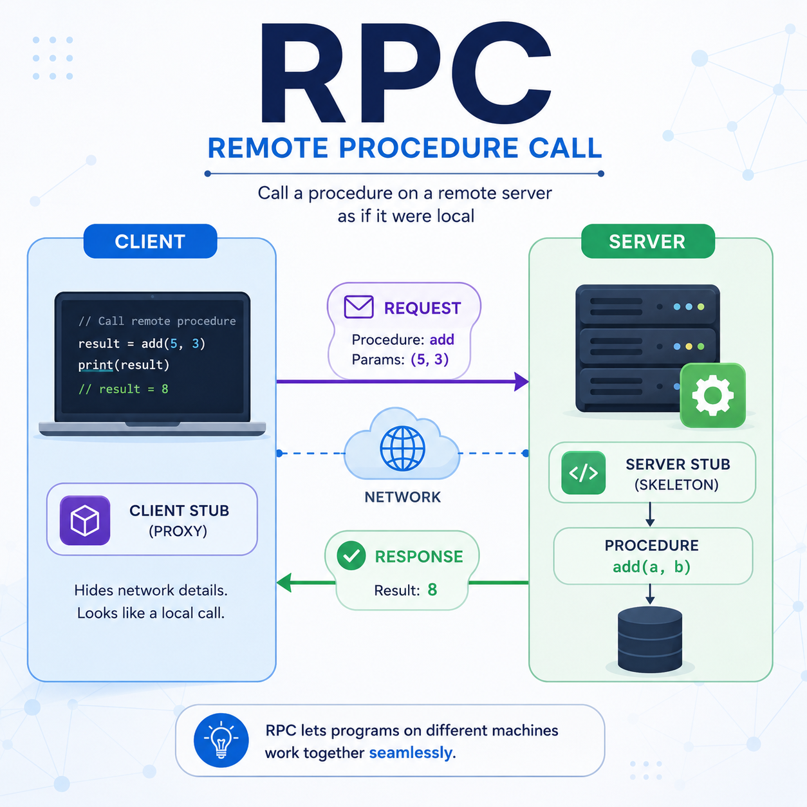
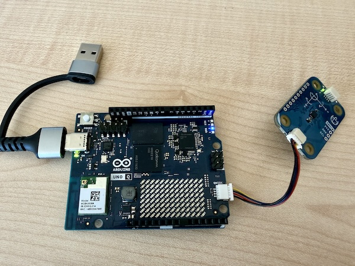
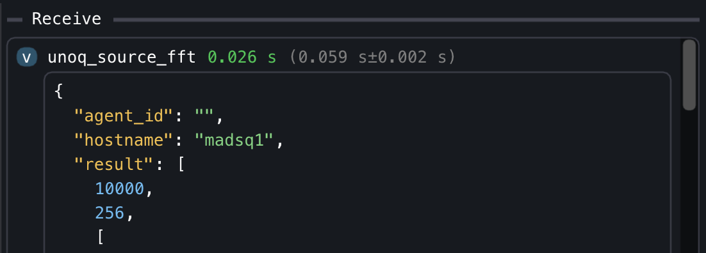

<a href="https://github.com/mads-net/arduinoQ_plugin" target="_blank" rel="noopener noreferrer">
  
</a>

# Context

The [Uno Q](hhttps://www.arduino.cc/product-uno-q) is a new addition to the Arduino Uno family, featuring a powerful microcontroller and enhanced connectivity options. What sets it apart from its predecessors are the two onboard controllers: a CPU running Linux Debian, and a microcontroller (MCU) that can run Arduino code. This dual-controller architecture allows for more complex applications and seamless integration with various sensors and peripherals.

:::aside
**RPC** stands for *Remote Procedure Call*
:::

The communication between the Linux CPU and the Arduino MCU is facilitated through Linux service called [Arduino Router](https://docs.arduino.cc/tutorials/uno-q/user-manual/#bridge---remote-procedure-call-rpc-library), which tunnels Remote Procedure Calls (RPC) from the Linux side to the Arduino side and vice-versa. Via RPC, a function implemented on the MCU side (which has access to all physical pins and peripherals) can be called from the Linux side, and a function implemented on the Linux side (which has access to the network and more powerful processing capabilities) can be called from the MCU side. This allows for a seamless integration between the two controllers, enabling developers to leverage the strengths of both environments in their applications.

With respect to solutions where a simple Arduino Uno is used in combination with a separate Linux computer (e.g. a Raspberry Pi), the Uno Q offers several advantages:

* it is cheaper
* it is more compact
* it has a more powerful microcontroller
* it is (currently) simpler to procure

If you compare this solution to a single Raspberry Pi, the Uno Q offers the advantage of having a real-time microcontroller that can handle time-critical tasks and interact with sensors and actuators with low latency, and to have direct access to **analog I/O** pins.

# Requirements for this guide

In this guide, we assume to have:

* a PC/laptop running Linux, macOS or Windows, with MADS v2.1.x installed
* an Arduino Uno Q, with the latest firmware and **MADS v2.1.x already installed** (use the same Linux-arm64 deb installer as for the Raspberry Pi, which is compatible with the Uno Q)
* your PC and the Arduino connected via USB-C data cable, which provides power to the Uno Q as well as a tunneled network connection between the Linux CPU and the Arduino MCU
* the Arduino IDE installed on your PC, with the Uno Q board support package installed (see [Arduino documentation](https://docs.arduino.cc/tutorials/uno-q/user-manual/#getting-started) for details)

On top of that, we need the collection of `arduinoQ_plugin` binaries, available as release here: <https://github.com/MADS-NET/arduinoQ_plugin/releases>. look for the latest package named `arduinoq-<VERSION>-linux-aarch64.tar.gz`, right click and copy its address. 


::: {.callout-warning}
Be sure to have MADS installed before proeeding: run `mads --version` **on the Uno Q**, and if it is not installed, follow the instructions in the [MADS installation guide](install.qmd) to install it before proceeding with this guide.
:::


Then open a `ssh` connection to the Uno Q, and run the following commands:

```sh
wget <PASTE_COPIED_URL_HERE>
sudo tar -xzf arduinoq-<VERSION>-linux-aarch64.tar.gz -C $(mads -p) --strip-components=1
mads --plugins
```

The last command shall show the list of available plugins, which should now include `unoq_source.plugin`, `unoq_sink.plugin` and `unoq_filter.plugin`. It also installs the `qrpc_call` executable, which is used to call functions implemented on the Arduino MCU from the Linux side during the development phase, as we will see later.


::: {.callout-important}
Be sure to read the [README.md](https://github.com/MADS-NET/arduinoQ_plugin) before proceeding!
:::


# Working principle

The Arduino Uno Q has a 64 bit, quad core ARM CPU with Debian Linux installed, beside a microcontroller that can run Arduino code (aka **sketches**). The communication between the Linux CPU and the Arduino MCU is facilitated through Linux service called [Arduino Router](https://docs.arduino.cc/tutorials/uno-q/user-manual/#bridge---remote-procedure-call-rpc-library), which tunnels Remote Procedure Calls (RPC) from the Linux side to the Arduino side and vice-versa. Via RPC, a function implemented on the MCU side (which has access to all physical pins and peripherals) can be called from the Linux side, and a function implemented on the Linux side (which has access to the network and more powerful processing capabilities) can be called from the MCU side.

{width=75%}

The RPC mechanism is based on the MsgPack-RPC protocol. Currently, the official Arduino IDE for the Uno Q is the Arduino App Lab, which only provides a Python library to make RPC calls from the Linux side, and the support for other languages is ill-documented, at best.

The message transport layer between CPU and MCU is a high speed dedicated serial connection, which is managed by a Linux service called Arduino Router. This service creates a POSIX pipe on the Linux side, so that any Linux process can use a socket to that pipe to send and receive msgPack-encoded RPC calls. Be sure to check [this guide](https://docs.arduino.cc/tutorials/uno-q/user-manual/#bridge---remote-procedure-call-rpc-library) to learn how to start/stop the Arduino Router service in case you have problems (note that it is enabled and running by default).

:::aside
**CPU** stands for *Central Processing Unit* (the Linux part), while **MCU** stands for *Microcontroller Unit* (the Arduino part).
:::


The three plugins provided in the `arduinoQ_plugin` package are implemented in C++ and use the [MsgPack-RPC C++ library](https://github.com/msgpack/msgpack-c), and are designed to simplify the development of MADS agents that can directly call functions implemented on the Arduino MCU from the Linux side via RPC calls.

The three provided plugins provide an easy way to call a RPC function via a properly defined JSON message. The developer shall only implement the function on the Arduino side, and then call it from the Linux side via a properly defined JSON message, without needing to worry about the details of the RPC protocol or the communication between the two controllers.

The generic JSON schema for a RPC call is:

```json
{
  "rpc_func": "function_name",
  "rpc_args": [arg1, arg2, arg3, ...]
}
```

Where `function_name` is the name of the function implemented on the Arduino side and **exported as an RPC function**, and `arg1`, `arg2`, `arg3`, ... are the arguments to be passed to the function (possibly none). 

## The source plugin

The `unoq_source.plugin` is a source plugin that allows to call a RPC function implemented on the Arduino MCU from the Linux side, and to publish the returned value on a MADS topic.

Since it is a source, the JSON used to define the RPC call is **static** and provided via `mads.ini`. The plugin then invokes the RPC call at a regular interval (defined by the `period` setting in `mads.ini` or on the command line), and publishes the returned value on a MADS topic.

A possible source section would be:

```toml
[unoq_source]
pub_topic = "unoq_source"  # The topic on which the plugin will publish the output of the RPC call
rpc_func = "ping"  # The RPC call to execute (the function name on MCU)
rpc_args = [] # the list of its arguments, if any
period = 1000  # The period (in milliseconds) at which the RPC call will be executed
```


## The sink plugin

The `unoq_sink.plugin` is a sink plugin that allows to call a RPC function implemented on the Arduino MCU from the Linux side, with arguments taken from the payload of the incoming message. The schema of the JSON message is the same as above, while the INI section for the plugin lacks the RPC call definition, since it is provided in the incoming message:

```toml
[unoq_sink]
sub_topic = "unoq_sink"  # The topic from which the plugin will subscribe to incoming messages
verbose = false  # Whether to print output upon receiving a message
```

## The filter plugin

The `unoq_filter.plugin` is a filter plugin that allows to call a RPC function implemented on the Arduino MCU from the Linux side, with arguments taken from the payload of the incoming message, and to publish the returned value on a (different!) MADS topic. It is basically a combination of the source and sink plugins, since it subscribes to a topic for incoming messages, calls the RPC function defined in the incoming message with the provided arguments, and publishes the returned value on a MADS topic.

As for a sink plugin, the JSON message received by the filter plugin shall contain the RPC call definition, while the INI section for the plugin lacks it:ù

```toml
[unoq_filter]
sub_topic = "unoq_filter_in"  # The topic from which the plugin will subscribe to incoming messages
pub_topic = "unoq_filter_out"  # The topic on which the plugin will publish the output of the RPC call
verbose = false  # Whether to print output upon
```

## Input argument types

The arguments provided in the `rpc_args` field of the JSON message can be of any type supported by the MsgPack-RPC protocol, i.e. they can be any of the following types:

* `string`
* `int64_t`
* `double`
* `bool`
* an array of any of the above types


# Developing an Arduino sketch with RPC functions

Suppose that we have an IMU sensor implemented as a [Modulino Movement](https://docs.arduino.cc/hardware/modulino-movement/) module, connected to the Arduino MCU via its QWIIC connector, and we want to read its values on the MCU side, calculate an FFT of the accelerations, and provide this FFT upon request from the Linux side via RPC call.

{width=75%}

On the Linux/MADS side, we simply need to use the source plugin with a similare INI section:

```toml
[unoq_source]
pub_topic = "unoq_fft"
rpc_func = "get_fft"
rpc_args = [] 
period = 100  
```

where `get_fft` is the name of the function to be implemented on the Arduino side and exposed as RPC entry point.

To create a suitable sketch we need the following tools:

* a library to read the Modulino device: we can use the official `Arduino_Modulino`
* the official library to make RPC calls from the Arduino side: the `Arduino_RouterBridge` library, which is part of the Arduino IDE for the Uno Q
* the `MsgPack` library, to encode returned compound objects (e.g. the FFT array) in a format that can be properly decoded on the Linux side
* a process schedule, so we can regularly sample the IMU sensor. We will use the `TaskScheduler` library for that, which is a simple and efficient scheduler for Arduino
* a library to calculate the FFT: we can use the `KickFFT` library, which is a very efficent FFT library, although limited to input arrays of 512 elements


::: {.callout-tip}
Use the Arduino IDE *Library manager* tool to search and install these libraries!  
:::

Then we need to implement a structure that provides a circular buffer array to store tha last collected values, adding a new value at each sampling step, and another struct to represent the FFT result to be returned by the `get_fft` function. 

Let us writhe the sketch step by step.

## Include necessary headers and define global variables

```cpp
#include <Arduino_RouterBridge.h>
#include <Arduino_Modulino.h>
#define _TASK_MICRO_RES // TaskScheduler uses microseconds
#include <TaskScheduler.h>
#include <MsgPack.h>
#include <KickFFT.h>
#include <array>
#include <cmath>

// Customizable parameters for the FFT
static constexpr size_t RATE = 10'000; // samples/sec
static constexpr size_t SIZE = 512; // MUST be power of 2 and <=512
```

Note that the `TaskScheduler` class by default has a millisecond resolution. We can switch to microsecond resolution by defining the `_TASK_MICRO_RES` macro **before** including the library, which is necessary to achieve a sampling rate of 10 kHz.

The `KickFFT` library is particularly fast, but the drawback is that it only accepts sample sizes in power of 2 and up to 512. If that is not enough, you have to select a different FFT library (ther are many available in the Arduino IDE *Library Manager*).

## The fixed-size ring buffer

We implement a minimal circular buffer to store the last `SIZE` collected samples from the IMU sensor as a C++ struct. The buffer is implemented as a struct with an array of fixed size, and the index of the current position in the buffer. At each sampling step, we change the value at the index position and then increment it, wrapping around when we reach the end of the array:

```cpp
template <typename T, size_t N>
struct RingArray {
  T data[N]{};          // value-initialize elements
  std::size_t head = 0; // next write index

  void push(const T& val) {
    data[head] = val;
    ++head;
    if (head == N) head = 0;
  }
};
```

## The FFT result struct

We also create a C++ struct to represent the FFT result, which contains an array of `SIZE/2` complex numbers (the FFT of a real-valued signal is symmetric, so we only need to return the first half of the spectrum). We add a `calculate()` method that takes the input signal, calculates the FFT using the `KickFFT` library, and stores the result in the `mag` array (for *magnitude*):

```cpp
template <typename T, size_t R, size_t N>
struct FFTData {
  size_t rate_hz = R;
  size_t size = N/2;
  std::array<uint32_t, N/2> mag;
  MSGPACK_DEFINE(rate_hz, size, mag); // only these fields are published

  void calculate(T values[]) {
    KickFFT<float>::fft(R, 0, R/2.0, N, values, mag.data());
  }
};
```

Notes:

* the `MSGPACK_DEFINE` macro (provided by the `MsgPack.h` header) is used to define the fields that will be published via RPC call. In this case, we only publish the `rate_hz`, `size` and `mag` fields.
* the `mag` field must be defined as a `std::array` because the `MsgPack` library needs to know the size of the array at compile time to properly encode it. We cannot use C array syntax (e.g. `uint32_t mag[N/2]`) because that would not provide the necessary type information to the `MsgPack` library.
* the `calculate()` method takes an array of input values, calculates the FFT using the `KickFFT` library, and stores the magnitude of the FFT in the `mag` array, accessible as a C array via the `mag.data()` method. The `KickFFT::fft()` method takes as input the sampling rate, the frequency offset (0 in our case), the frequency resolution (which is half of the sampling rate divided by the size of the FFT), the size of the FFT, the input signal, and the output array for the magnitude.

## Types and globals

```cpp
// Types
typedef FFTData<float, RATE, SIZE> MyFFTData;

// Global vars are Capitalized
ModulinoMovement Movement;
RingArray<float, SIZE> Buffer;
Scheduler Runner;
```

We need to concretize the `FFTData` struct with the specific types and parameters we want to use for it to be usable via MsgPack. The remaining globals provide access to the Modulino IMU, to the ring buffer and to the task scheduler.

## The task scheduler

We need two regularly executed tasks: one to sample the IMU sensor and update the ring buffer, and one to blink the onboard LED to visually check that the sketch is running. We can use the `TaskScheduler` library to create these tasks and add them to the scheduler. Creating a task measn to define a function that will be executed at each step of the task, and then create a `Task` object with the desired period and the function to execute:

```cpp
// accumulates data at RATE Hz
void task_acquire() {
  Movement.update();
  Buffer.push(std::hypot(Movement.getX(), Movement.getY(), Movement.getZ()));
}
Task AcquireTask(1e6/RATE, TASK_FOREVER, &task_acquire);

// blinks the LED every second
Task WatchdogTask(1e6, TASK_FOREVER, &task_watchdog);
void task_watchdog() {
  static auto state = HIGH;
  digitalWrite(LED_BUILTIN, state ? LOW : HIGH);
  state = (state == LOW ? HIGH : LOW);
  // You might also print con Monitor console...
  // Monitor.println(Buffer.head);
}
```

## Sketch setup and main loop

In the `setup()` function of the sketch, we need to initialize the serial connection (to print debug messages on the Monitor console), initialize the Modulino device, add the tasks to the scheduler, and start the Arduino Router service `Bridge` to enable RPC calls. We also need to provide the `get_fft` function as an RPC entry point, so that it can be called from the Linux side via the `unoq_source.plugin`:

```cpp
void setup() {
  pinMode(LED_BUILTIN, OUTPUT);
  Monitor.begin();
  Monitor.print("Arduino Router starting... ");
  // Movement setup
  Modulino.begin();
  Movement.begin();

  // Scheduler setup
  Runner.init();
  Runner.addTask(AcquireTask);
  AcquireTask.enable();
  Runner.addTask(WatchdogTask);
  WatchdogTask.enable();

  // Bridge setup
  Bridge.begin();
  Bridge.provide("get_fft", get_fft);

  Monitor.println("done!");
}

void loop() {
  Runner.execute(); // remember to enable scheduler!
}
```

## Implement the RPC entry point

Finally, we need to implement the `get_fft` function, which will be called from the Linux side via RPC call. This function needs to calculate the FFT of the values stored in the ring buffer and return it as a `MyFFTData` object, which will be properly encoded by the `MsgPack` library and decoded on the Linux side:

```cpp
// RPC Call, gets no input and returns a MyFFTData struct
MyFFTData get_fft() {
  MyFFTData out{};
  out.calculate(Buffer.data);
  return out;
}
```

::: {.callout-tip}
The whole sketch is available in the `arduino` folder of the `arduinoQ_plugin` project repository [here](https://github.com/MADS-NET/arduinoQ_plugin/tree/main/arduino/rpc_server_modulino).
:::


# Testing and usage

Once the sketch is compiled and uploaded to the Arduino Uno Q, you can quickly test it by connecting via ssh to the Uno Q and running the following command, while shaking the Modulino sensor:

```bash
qrpc_call get_fft
```

The output should be something like:

```
Connecting to RPC server at "/var/run/arduino-router.sock" and calling function 'get_fft' with arguments:
RPC call result: [10000, 256, [611, 10, 17, 7, 3, 9, 9, 6, 7, 60, 25, 16, 9, 11, 6, 2, 8, 9, 22, 22, 12, 8, 5, 2, 0, 3, 2, 2, 4, 2, 2, 1, 1, 0, 0, 0, 1, 0, 0, 0, 0, 1, 1, 1, 1, 0, 1, 1, 0, 0, 0, 0, 0, 0, 0, 0, 0, 1, 0, 0, 0, 0, 0, 1, 0, 1, 0, 0, 0, 0, 0, 0, 0, 0, 0, 0, 0, 0, 0, 0, 0, 0, 0, 1, 0, 0, 0, 0, 0, 0, 0, 0, 1, 1, 0, 0, 0, 0, 0, 0, 0, 0, 0, 0, 0, 0, 0, 0, 0, 0, 0, 0, 0, 0, 0, 0, 0, 0, 0, 0, 0, 0, 0, 0, 0, 1, 1, 3, 3, 1, 0, 0, 0, 0, 0, 0, 0, 4, 1, 0, 0, 0, 0, 0, 0, 0, 0, 0, 0, 0, 0, 0, 0, 0, 0, 3, 1, 1, 0, 0, 0, 0, 0, 1, 1, 2, 1, 0, 0, 0, 0, 0, 0, 0, 0, 0, 0, 0, 0, 0, 0, 0, 0, 0, 0, 0, 0, 0, 0, 0, 0, 0, 0, 0, 0, 0, 0, 0, 0, 0, 1, 1, 0, 0, 0, 0, 0, 0, 0, 0, 0, 1, 0, 0, 0, 0, 0, 0, 0, 0, 0, 0, 0, 0, 0, 0, 0, 0, 0, 2, 0, 0, 0, 0, 0, 0, 0, 0, 1, 1, 0, 0, 0, 0, 0, 0, 0, 0, 0, 0, 0, 0, 0, 0, 0, 0]]
```

The first two element in the output (`10000` and `256`) are the `rate_hz` and `size` fields of the returned `MyFFTData` struct, while the third element is the `mag` array containing the magnitude of the FFT. You can check that the values in the `mag` array change when you shake the Modulino sensor, which means that the RPC call is working properly and that the FFT is being calculated on the Arduino side and returned to the Linux side.

::: {.callout-note}
The path `"/var/run/arduino-router.sock"` is the POSIX socket used by the Arduino Bridge to tunnek MsgPack RPC calls from the CPU to the MCU.
:::

The `qrpc_call` command is a simple and useful utility that can help in the development of RPC-enabled sketches on the MCU side. Once it reports the expected data, you may launch a MADS plugin being reasonably sure that the RPC call will work properly, and that the data returned by the RPC call will be properly published on the MADS topic defined in the plugin INI section.

In our case, to test the whole pipeline in MADS we can work like this:

1. On your PC/laptop:
    a. copy/clone the `director.toml` and the `mads.ini` files from the root of the `arduinoQ_plugin` project repository to a local folder on your PC/laptop
    b. launch the MADS director with `mads director` (or use the MADSCode Visual Studio Code extension...)
    c. launch the `mads chat` GUI and connect to the local broker, so you can monitor incoming messages
2. On the Uno Q:
    a. launch the source agent: `mads source unoq_source.plugin --name unoq_source_fft -p 100`

Now shake the Modulino sensor and you shall see the changing values in the `mads chat` GUI.


::: {.callout-note}
### Some important remarks
1. We are calculating the FFT over a circular buffer. This may result in some undesired spectral leakage. In a real application, you would either avoid the circular buffer and use a proper flat array (though it may be more costly in terms of memory and CPU usage), or you would implement a more complex buffering strategy to avoid spectral leakage (e.g. by applying a windowing function to the input signal before calculating the FFT: use a cyclic Hamming window that goes to zero at the current buffer head position).
2. We are keeping the two structs separated for the sake of clarity, but you might want to merge them together in a single struct with methods for adding a new data, applying a rolling Hamming window and calculate the FFT, and with the `MSGPACK_DEFINE` macro that only defines the fields to be published, so that you can keep all the logic related to the FFT calculation in a single struct.
3. The performance of the provided code might be not enough for a 10 kHz sampling rate, especially when using a scheduler that can randomly interrupt the execution of the sampling phase.
4. **MsgPack RPC protocol sets a size limit of 256 bytes for the payload of a RPC call**. This means that if you try to return a very large array (e.g. a large FFT result), you might exceed this limit and get an error on the Linux side when trying to decode the returned value. In that case, you would need to implement a custom solution to split the returned value into smaller chunks and reassemble it on the Linux side, or to use a different communication mechanism between the CPU and the MCU (e.g. a shared memory buffer or a file-based approach).

That said, the provided code is a good starting point for developing more complex applications on the Arduino Uno Q that leverage the RPC mechanism to integrate the capabilities of both the Linux CPU and the Arduino MCU in a seamless way. You can use it as a template for your own sketches, and customize it according to your needs and the specific sensors and peripherals you want to use with the Uno Q.
:::


# Reverse mode source plugin

## The problem of timing

In the above example, **the timing is set by the source plugin**: the `unoq_source.plugin` is configured to call the `get_fft` RPC function at a regular interval (defined by the `period` setting in `mads.ini` or on the command line), and to publish the returned value on a MADS topic. This means that the RPC call is executed on the MCU at a rate defined by the source plugin on the CPU, which might be not really deterministic, especially if the CPU is under heavy load or if the scheduler interrupts the execution of the source plugin.

Furthermore, if we let run the plugin at max rate (no `period` setting, so that the plugin calls the RPC function as soon as it receives a response from the previous call), we can achieve a maximum message rate of about 1/60ms = 16 messages per second:

{width=75%}

This means that the Arduino MCU is calculating the FFT at 10 kHz over a rolling window of 512 samples, but the CPU is reading (and publishing on MADS network) only one FFT value every 60 ms, which is fine if the frequencies of interest fall within 5 kHz (Nyquist frequency), and the system dynamics is slow enough that a 60 ms update rate is sufficient, but it may be not enough for some applications (i.e. when the frequencies of interest may change faster than 60 ms).

## Reversing the communication flow

An alternative and sometimes more efficient solution to this problem is to reverse the communication flow: instead of having the source plugin on the CPU side that calls the RPC function on the MCU at a regular interval, we can use the MsgPack-RPC **notify** mechanism to have the MCU side call a function on the CPU side every time new data value is available. The plugin then may buffer the received data and publish it on MADS at regular intervals, clearing the buffer after each publication. 

This way, **the timing of the data acquisition is set by the MCU side**, which can be more deterministic and can ensure that we do not miss any important data value, while the CPU side can still control the publication rate on MADS by setting the `period` parameter in the plugin INI section (or by running at maximum speed).

The `unoq_source.plugin` already supports this reverse communication flow, which can be enabled by setting the `rpc_notify` parameter in the plugin INI section to `true`. More detailedly, to switch to this reverse mode, you need to:

1. Implement a function on the Arduino side that will be called every time new data is available (e.g. every time a new FFT value is calculated). This function needs to use the `Bridge.notify()` method to send the new data value to the CPU side via RPC notify mechanism.
2. Configure the `unoq_source.plugin` to listen for the notify messages from the Arduino Router service, and to publish the received data on a MADS topic at a regular interval (defined by the `period` setting in `mads.ini` or on the command line).

The MCU sketch may be actually quite simpler:

```cpp
#include <Arduino_RouterBridge.h>

uint32_t Counter = 0;
uint32_t LastNotifyMicros = 0;

void setup() {
  Monitor.begin();
  Monitor.print("Arduino Router starting... ");
  Bridge.begin();
  // No need to map RPC entry points!
  Monitor.println("done!");
}

void loop() {
  // Execute every 0.5 ms:
  const uint32_t now = micros();
  if (now - LastNotifyMicros < 500) {
    return;
  }
  LastNotifyMicros = now;

  // Notify any number of parameters under the name "mads_notify"
  Bridge.notify("mads_notify", Counter++, now);
  // you might want to notify other values under a different name, just call:
  Bridge.notify("mads_other", "other message");
  // And remember to add in the ini file under the key `provided_rpc` the list 
  // of notify names, eg `provided_rpc = ["mads_notify", "mads_other"]`
}
```

The `mads.ini` settings file has to contain a section like:

```ini
[unoq_source_notify]
mode = "notify" # normal and default mode is "call"
# provided_rpc = "mads_notify" # if there is only one notification
provided_rpc = ["mads_notify", "mads_other"] # if you have more than one notify message
max_queue = 256 # This is the queue on the CPU side of the Uno Q
overflow = "drop_oldest" # or "drop_newest"
```

Finally, launch the plugin with:

```bash
mads source unoq_source.plugin --name unoq_source_notify -r -p 100
```

which publishes a new message on the `unoq_source_notify` topic every 100 ms with the latest queue received from the Arduino MCU via notify messages, in the shape of:

```json
{
  "mads_notify": [
    [123, 456],
    [124, 556],
    ... and so on for about 200 times
  ],
  "mads_other": [
    ["other message"], 
    ["other message"],
    ... and so on for about 200 times
  ]
}
```

The *about 200 times* is because the CPU side is not deterministic, and some iteration may take longer od shorter than 100 ms, so we may receive more or less than 200 notify messages, published by the MCU every 0.5 ms sharp.


## Which mode shall we use?

Of course, wether to use `"call"` or `"notify"` mode depends on the specific application and requirements. 

The `"call"` mode is generally preferable when you want to collect data from the MCU at slower rates (~100 ms), and you want to do some data preprocessing on the MCU side. In these cases, the sketch template reported above (and available on the repo at [`arduino/rpc_server_modulino`](https://github.com/MADS-NET/arduinoQ_plugin/tree/main/arduino/rpc_server_modulino) is a good starting point, and you can simply customize the `get_fft` function to return the data you want to publish on MADS.

The `"notify"` mode is generally preferable when you want to collect data from the MCU at faster rates (e.g. 10 kHz or more), and you want to do as little preprocessing as possible on the MCU side, just sending the raw data values to the CPU side as soon as they are available. In these cases, the sketch template reported above (and available on the repo at [`arduino/rpc_notify`](https://github.com/MADS-NET/arduinoQ_plugin/tree/main/arduino/rpc_notofy) is a good starting point, and you can simply customize the `loop()` function to send the data you want to publish on MADS via notify messages.