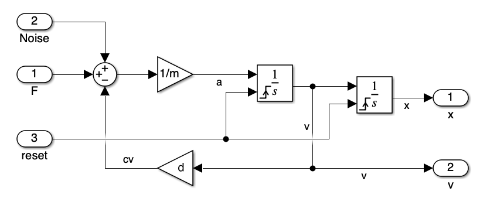
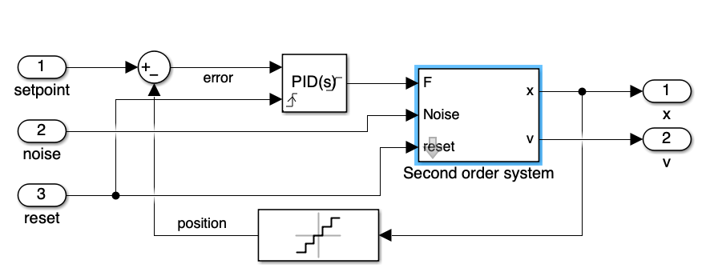
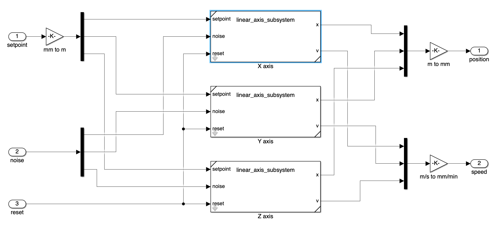
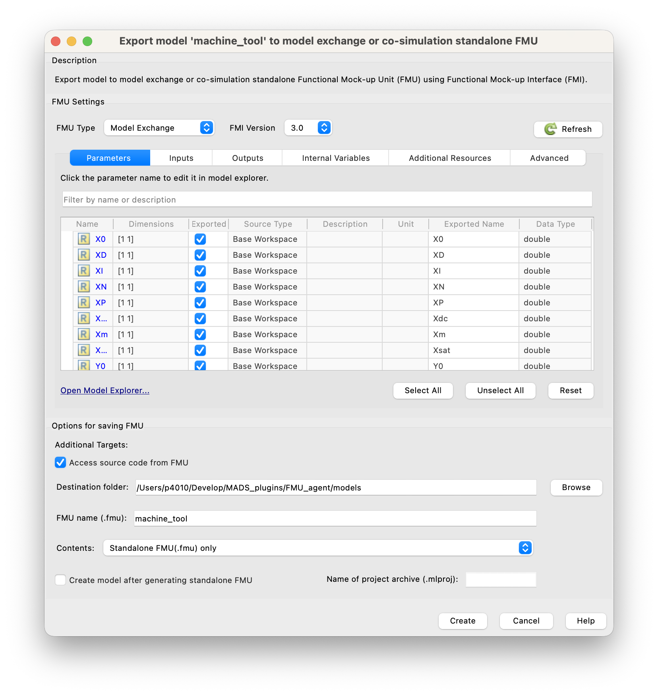

# FMI/FMU Overview

[Functional Mockup Interface](https://fmi-standard.org/) (FMI) is a standard for model exchange and co-simulation of **dynamic systems**.
An **FMU** (Functional Mockup Unit) is a compiled version of a model that can be used in different simulation environments that support the FMI standard.
FMUs can be used for both model exchange (where the model is imported into the simulation environment) and co-simulation (where the model runs in its own environment and communicates with the simulation environment).
FMUs are typically created using tools like Modelica, Simulink, or other modeling environments that support FMI export.

::: {.callout-important}
The FMI standard is currently at **version 3.0**, which is the only format version supported by MADS.
:::

# Creating an FMU

To create an FMU, you can use a modeling tool that supports FMI export, such as Modelica or Simulink. In this guide, we will use Simulink as an example, creating a dynamic model of a 3-axes cartesian manipulator, made by three identical subsystems, each one made by a mass, a spring, and a damper. The model must contain input and output ports, which will be used for communication with the MADS environment.

:::aside
An FMU is actually a **zip file** that contains the compiled model, along with some metadata and possibly the source code of the model. The structure of the FMU file is defined by the FMI standard, and it includes a `modelDescription.xml` file that describes the model and its interface, as well as a `sources` folder that contains the source code of the model (if included) and a `binaries` folder that contains the compiled binaries for different platforms.
:::

:::{layout-ncol=2}
{.lightbox}

{.lightbox}
:::



In the overall model, note that we have input and output ports:

- The input ports are used to receive the control signals for the three axes (u1, u2, u3). Here we decided to unbundle the input, that **must be a vector** of size 3, into three separate signals, for better readability.
- The output ports are used to obtain the position and speed of each axis, again we decided to bundle the outputs into two vectors of size 3, for better readability.

Note that your model must be **causal** (i.e., it must have a clear input-output structure) and must not contain algebraic loops, as these can cause issues during simulation.

Also, your model usually depends on **parameters**. If so, clearly define the parameters using **block masks**, so that they are usually loaded from the workspace when the simulation runs in Simulink. Also, assign clear and meanningful names to the input and output ports, for those will be farried forth by the FMI interface and ultimately used in the MADS environment.

:::{.callout-warning}
When creating an FMU, make sure to follow the guidelines of the FMI standard and to test your model thoroughly in the original modeling environment before exporting it as an FMU. This will help ensure that the FMU works correctly when imported into the MADS environment.

Also, be aware that if you use **custom blocksets or advanced Simulink features**, in order to be able to run the FMU you would need to also install the Simulink Runtime on the machine where you want to run the FMU, which is not always possible. For this reason, it is recommended to use only basic Simulink blocks and features that are widely supported by the FMI standard.
:::

Once ready, you can export the model as an FMU by clickin on the "*Save*" drop down menu and pick the "*Standalone FMU...*" option. This will open the FMU Export window, where you can specify the name and location of the FMU file, as well as some options for the export process. Make sure to select the correct FMI version (3.0) and to check the "*Access source code from FMU*" option if you want to include the source code of the model in the FMU file.



:::aside
Carefully check all the tabs in the export panel and be sure that inputs, outputs, and parameters are correctly identified and named, with the data type you expect. This will ensure that the FMU can be correctly used in the MADS environment.
:::

::: {.callout-tip}
Checking the "*Access source code from FMU*" option also includes the source code in the generated FMU, which in turn allows to **re-compile the FMU for different targets**. This is particularly important if you develop the FMU on, say, a Windows machine and plan to run it on a Linux machine, where the pre-compiled binaries included in the FMU may not be compatible. By including the source code, you can re-compile the FMU on the target machine, ensuring compatibility and optimal performance.
:::


# Using the FMU in MADS

FMUs can be used in MADS thanks to the [`FMU_agent`](https://github.com/mads-net/FMU_agent){target="_blank"}, which provides an interface for loading and running FMUs within the MADS environment. That repo provides a C++ agent that can be compiled and installed in your MADS environment, allowing you to run FMUs as part of your simulations and control applications.

## Build

As usual for MADS plugins and agents:

```sh
cmake -Bbuild -DCMAKE_BUILD_TYPE=Release
cmake --build build -j6
```

A few notes:

- The option `MADS_INSTALL_AGENT` (default: off) enables installation in the prefix directory of the `mads-fmu` agent, so that you can call it as `mads fmu`
- The default install prefix is the MADS folder (as for `mads -p`)
- The option `MADS_BUILD_FMU` (default: off) enables compilation and creation of the FMU units from the source files available in the `models` directory; those are intended for testing purposes

::: {.callout-tip}
In other words, if you have your own FMU file, you can reuse the CMakeLists.txt script in the project directory to recompile your FMU for your target directory, by setting the `MADS_BUILD_FMU` option to `ON` and placing your FMU source files in the `models` directory. This way, you can create a compatible FMU file that can be used with the `FMU_agent` in your MADS environment.
:::


## FMUs

Currently, only **model exchange** FMUs version 3.0 are supported. Co-simulation FMUs are not supported. This means that the solver is the one embedded in the agent and you cannot embed the solver in the FMU file.

### Example FMUs

FMUs are actuallt zipped folders that contain some XML file providing model description and a **compiled dynamic library**, which is supposed to be run-time loaded by the software using it.

FMU files are typically exported from simulation software in the **compiled** format, which is only compatible with the working platform. In other words, a FMU file generatd on Intel Windows won't run on a Silicon macOS (and *vice-versa*).

The project `model` directory contains example FMUs in **source format**, so that they can be compiled on the working machine producing a usable `.fmu` file. When you enable the CMake switch `MADS_BUILD_FMU`, the FMUs are compiled; upon `cmake --install build` the zipped units are also created and saved in the `models/fmu` directory.

The provided example FMUs are:

- `DoubleMassSpringDamper`: name says it all. No inputs.
- `linear_axis`: a second-order dynamics linear actuator with a PID controller on position. Inputs: setpoint; outputs: axis position and speed.
- `machine_tool`: a cartesian manipulator made by a combination of three linear axes.


## Execution

Once the agent is compiled and you have a valid FMI3.0 compatible `my_model.fmu` file, you shall chek it for the actual naming of internal variables. Assuming that the agent has been installed (with `cmake --install build`), and that the FMU file is in your current working directory:

```sh
mads fmu models/fmu/linear_axis.fmu --inspect
```

which results in:

```text
Inspecting model at:    models/fmu/linear_axis.fmu
Model name (from .fmu): linear_axis
Agent name (default):   fmu_linear_axis
Variables:
           Name    Description         Data type      Causality        Initial
       setpoint       setpoint           Float64          input          exact
         noiseX        noise X           Float64          input          exact
          reset          reset           Boolean          input          exact
              X              X           Float64         output     calculated
             Vx             Vx           Float64         output     calculated
             X0             X0           Float64      parameter          exact
             XD             XD           Float64      parameter          exact
             XI             XI           Float64      parameter          exact
             XN             XN           Float64      parameter          exact
             XP             XP           Float64      parameter          exact
            Xdc            Xdc           Float64      parameter          exact
             Xm             Xm           Float64      parameter          exact
           Xsat           Xsat           Float64      parameter          exact
            res            res           Float64      parameter          exact

INI settings section (defaults):
[fmu_linear_axis]
period = 100
pub_topic = "fmu_linear_axis"
sub_topic = ["linear_axis_control"]
relative_tol = 1e-4
absolute_tol = 1e-5
hmin_tol = 1e-10
[fmu_linear_axis.parameters]
# default values from FMU
X0 = 0
XD = 100
XI = 0.001
XN = 100
XP = 0.3
Xdc = 0.1
Xm = 100
Xsat = 10000
res = 1e-06

Dependencies:
  @rpath/linear_axis.dylib
  /usr/lib/libSystem.B.dylib
```

This is giving you a table of model variables (with  names, causality and data type) and a suitable stub section for the `mads.ini` file. Copy that into your settings file, update the fields as needed and launch the `mads broker` command, if it is not running already.

::: {.callout-warning}
You also get the list of **dependencies** of the FMU, which are the dynamic libraries that the FMU needs to run. Carefully check that this list is short enough (as the one above): if it is longer, you probably need to install the Matlab Runtime. If you have the Matlab Runtime installed, make sure that the path to the Matlab Runtime libraries is included in your system's library search path (e.g., `LD_LIBRARY_PATH` on Linux, `DYLD_LIBRARY_PATH` on macOS, or `PATH` on Windows). This will allow the FMU to find and load the necessary libraries at runtime.
:::


::: {.callout-note}
The inspect command reports the file name and the **model name**. The latter can be different from the file name, and it is set by the software that generated the FMU. On the MADS network, the agent running the FMU will have the name `fmu_<model name>`, also reported by the inspect command. Inless overridden by the `--name` switch, this is the expected section name in the INI settings file `mads.ini`.
:::

Now you can run the agent:

```sh
mads fmu my_model.fmu
```

Note that by default the model runs at 100 ms period. You can change that either via the `period` value in the INI section, or override that via the `-p|--period` command line option.

The model is routinely evaluated and forward integrated at variable timestep, and the new status is published on the `pub_topic`. At any time, a **new input** can be gived via the MADS network, by publising to the `sub_topic` a JSON message as:

```json
{
  "fmu_input": {
    "in_var1": 123.0,
    "in_var2": 0.123
  }
}
```

To reset the model to its initial state, send the following:

```json
{"fmu_reset": true}
```