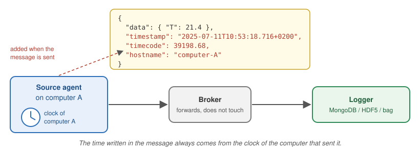
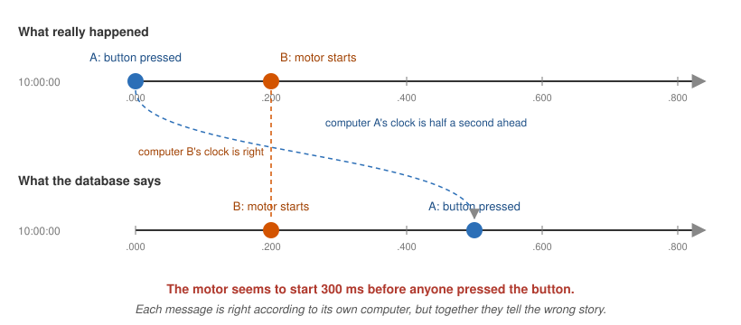
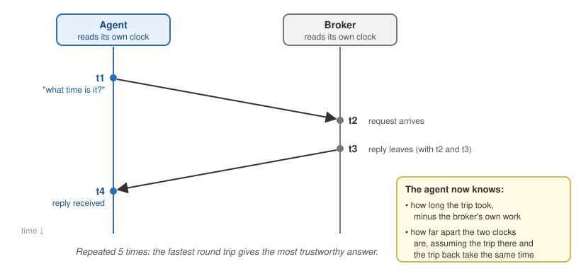
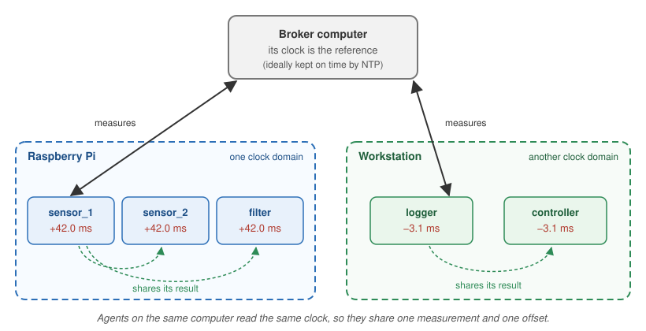

# Why time matters

A MADS network usually spans several computers: a Raspberry Pi reading sensors,
a workstation running a controller, a server storing everything in a database.
When you look at the data afterwards, you want to answer questions like:

* *did the temperature rise before or after the motor started?*
* *how long did the controller take to react to that alarm?*
* *what were all sensors reading at 10:53:18?*

To answer them, every message must carry the time at which it was produced,
**and those times must be comparable across computers**. This guide explains
how MADS writes time into messages, why different computers rarely agree on
what time it is, and how MADS v2.5.0 helps you measure and fix the
disagreement.

::: callout-tip
## Short version

* Every message gets a `timestamp` and a `timecode`, read from the clock of the
  computer that **sent** it.
* Computer clocks drift apart. The standard fix is **NTP**, a service that
  keeps a computer's clock on time.
* From **v2.5.0**, every agent automatically measures how far its clock is from
  the broker computer's clock. Run `mads top --probe` to see it.
* If you can't (or don't want to) set up NTP everywhere, add
  `clock_correction = true` to the `[agents]` section of `mads.ini`: all
  timestamps will then be aligned to the broker's clock.
:::

# How MADS puts time into a message

Every time an agent publishes a message, MADS adds three fields to it (unless
the message already has them):

```json
{
  "data": { "T": 21.4 },
  "timestamp": { "$date": "2025-07-11T10:53:18.716+0200" },
  "timecode": 39198.68,
  "hostname": "computer-A"
}
```

`timestamp`
: The date and time, down to the millisecond, in the standard *ISO 8601*
  format. The final `+0200` is the time zone of the sending computer, so the
  timestamp identifies one exact instant no matter where it was produced. The
  odd-looking `{"$date": ...}` wrapper lets MongoDB store it as a real date,
  so you can search and sort by it. This is the field used by the loggers
  and by [the replay agent](replay.qmd).

`timecode`
: The number of seconds since **local midnight**, rounded to a *frame*. It is a
  plain number, which makes it convenient for plots and for lining up samples
  from different sources. The frame length is set by `timecode_fps` in the
  `[agents]` section of `mads.ini`: with the default of 25 frames per second,
  timecodes are multiples of 40 ms. In the example, 39198.68 s is 10:53:18.68.

`hostname`
: The name of the computer that sent the message.

The important point is **where** these values come from:

{fig-alt="A source agent on computer A sends a message through the broker to a logger. The timestamp, timecode and hostname fields are added by the source agent, using computer A's clock. The broker and the logger do not change them." width=100%}

The time is read **from the clock of the computer that sends the message**, at
the moment the message is sent. The broker only forwards the message, and the
logger stores it as it arrives. Neither of them changes the time.

So if computer A's clock is wrong, every message from computer A carries a
wrong time, and nothing further along the chain will notice.

::: callout-note
If your plugin or script already puts a `timestamp` or `timecode` field in the
message, MADS keeps yours. This is useful when your device has its own precise
acquisition time, such as a data acquisition board with a hardware clock. It also
means that you are responsible for that time being correct.
:::

## Timecode caveats

The timecode is handy but has three limits you should know about:

* **It restarts at midnight.** A recording spanning midnight goes from
  86399.96 back to 0. Use `timestamp` when you need the date too.
* **It uses local time.** Two computers set to different time zones produce
  timecodes that are hours apart for the same instant. Set all MADS computers
  to the same time zone, or use `timestamp`, which includes the time zone.
* **It is rounded to the frame.** At 25 fps, two messages sent 10 ms apart can
  have the same timecode. If you need finer resolution, use `timestamp` or
  raise `timecode_fps`.

# The problem: every computer has its own clock

Every computer keeps time with a small quartz crystal. These crystals are
cheap and good, but not perfect: a typical one gains or loses a few seconds
per day, and the exact amount changes with temperature. Some situations make
it worse:

* A **Raspberry Pi** has no battery-backed clock. When it boots without a
  network connection, it starts from the last time it remembers, which can be
  hours or days in the past.
* A **virtual machine or container host** that has been suspended can wake up
  with its clock stuck at the moment it was suspended.
* A clock that was **set by hand** is usually off by a few seconds from the
  start.

Left alone, two computers that agree today will disagree by seconds after a
few weeks. For a MADS network this matters a lot, because it changes the story
your data tells:

{fig-alt="Two timelines. On the first one, labelled what really happened, the button press on computer A happens at 10:00:00.000 and the motor start on computer B at 10:00:00.200. On the second one, labelled what the database says, computer A's clock is half a second ahead, so the button press is recorded at 10:00:00.500, after the motor start." width=100%}

Here, computer A's clock is only half a second ahead, and the database now says
the motor started *before* the button was pressed. With the same error, a
measured reaction time could come out *negative*, or two signals that should
be in step could appear shifted. You will not get an error message: the data
simply looks wrong, or worse, looks right but isn't.

::: callout-important
Nothing in the data itself tells you whether the clocks were in agreement. You
have to check it **while the system is running**, because once the data is in
the database it is usually too late to find out.
:::

# The classic fix: NTP

The standard solution, used by nearly every computer connected to the
internet, is the **Network Time Protocol (NTP)**. A small service on each
computer regularly asks a *time server* what time it is, measures how long the
answer took to arrive, and gently adjusts the local clock so it stays in step.
With a good setup, computers on the same local network agree to within a
millisecond or better. Over the internet, the agreement is within a few
milliseconds.

Most operating systems enable NTP by default, **as long as the computer can
reach a time server**. This is how to check it:

::: {.panel-tabset}
## Linux (and Raspberry Pi OS)

```sh
timedatectl status
```

Look for `System clock synchronized: yes` and `NTP service: active`. If your
system uses *chrony* (common on recent distributions), you can get more
detail, including the current error, with:

```sh
chronyc tracking
```

The `System time` line tells you how far the clock is from the NTP time.

## macOS

NTP is enabled in *System Settings → General → Date & Time → Set time and date
automatically*. To see the current error against a time server:

```sh
sntp time.apple.com
```

The first number printed is the difference in seconds between your clock and
the server's clock.

## Windows

NTP is enabled in *Settings → Time & language → Date & time → Set time
automatically*. To check its status from a terminal:

```powershell
w32tm /query /status
```

and to force an immediate update (from an administrator terminal):

```powershell
w32tm /resync
```
:::

## When NTP is not enough

NTP works well, but in real MADS installations you often hit one of these
cases:

* **The network is isolated.** Machine networks in labs and factories are often
  cut off from the internet, so no public time server can be reached. You can
  turn one of your computers into a local time server. The broker computer is
  a natural choice. For example, with chrony on Linux, add these two lines to
  `/etc/chrony/chrony.conf` on the broker computer and restart chrony:

  ```
  allow 192.168.1.0/24   # the address range of your MADS network
  local stratum 10       # keep serving time even with no internet
  ```

  Then point the other computers to it. However, this needs administrator
  access and some care on every machine.
* **You can't configure some of the devices.** This includes embedded boards,
  computers managed by someone else, or a colleague's laptop that joins for one
  experiment.
* **You don't know whether it is working.** NTP runs silently. Each computer
  can say whether *it* thinks it is synchronized, but nothing tells you
  whether the whole MADS network actually agrees *right now*.

This is where MADS v2.5.0 comes in.

# What's new in MADS v2.5.0

Starting with v2.5.0, MADS itself can **measure**, **show** and, if you ask
it to, **correct** the differences between the clocks of your computers. You
don't need to write any code for this, and in most cases you don't need to
change any settings either.

The reference clock is always **the clock of the computer running the
broker**. It doesn't matter whether that clock is exactly right. What matters
is that all agents are compared against the same clock, so that their
timestamps can be compared with each other.

## Step 1 — Each agent measures its offset (automatic)

When an agent starts, it contacts the broker to download its settings. Since
v2.5.0, it also runs a short time check with the broker. Five times in a row,
it asks the broker "what time is it?" and notes when the question left and
when the answer came back:

{fig-alt="Timing diagram between an agent and the broker. The agent sends a request at time t1, as read on its own clock. The broker receives it at t2 and replies at t3, both read on the broker's clock. The agent receives the reply at t4. From the four times, the agent computes the round-trip delay and the clock offset." width=100%}

The exchange produces four times. Two are read on the agent's clock and two on
the broker's clock. From these, the agent works out two things:

* the **delay**: how long the message spent travelling on the network, there
  and back
* the **offset**: how many milliseconds must be added to the agent's clock to
  read the same time as the broker's clock

This is the same method NTP uses. Out of the five attempts, MADS keeps the one
with the shortest delay, because a fast round trip leaves less room for
error.

The result is printed in the agent's startup summary:

```
  Timecode FPS:     25
  Timecode offset:  0 s
  Clock domain:     raspberrypi
  Clock offset:     42.017 ms (broker, 0 hops, delay 0.412 ms, ref sensor_1:1)
```

To read these lines:

* **Clock offset: 42.017 ms** means this computer's clock is about 42 ms
  *behind* the broker's clock. A negative number means it is *ahead*.
* **delay 0.412 ms** is the network round-trip time. On a wired local network
  this is typically well below a millisecond. On Wi-Fi it can be a few
  milliseconds.
* **Clock domain** and **ref** are explained in the next step.

::: callout-note
**Measuring does not change anything.** By default, MADS only measures and
reports the offset. Your computer's clock is never touched, and the timestamps
in your messages are exactly as they were before v2.5.0. Correcting the
timestamps is a separate choice (see [Step 3](#step-3-correct-the-timestamps-optional)).
:::

## Step 2 — Agents on the same computer share one measurement

All agents running on the same computer read the same clock, so they should
all have the **same** offset. If each agent measured on its own, they would get
slightly different numbers because of network noise. Their corrected
timestamps would then disagree by a fraction of a millisecond, for no reason.

To avoid this, agents on the same computer form a **clock domain**. Every few
seconds, each agent tells the others in its domain what it measured, and they
all adopt the same measurement: the one with the shortest network delay. No
configuration is needed.

{fig-alt="The broker computer at the top holds the reference clock. Below it, a Raspberry Pi with three agents forms one clock domain: one agent measures its offset against the broker and shares the result, so all three show +42.0 ms. A workstation with two agents forms a second clock domain, where all agents show −3.1 ms." width=100%}

The `ref` value in the startup summary, for example `sensor_1:1`, says which
agent's measurement is being used. All agents in the same domain should show
the same `ref`.

::: callout-tip
On Linux, the clock domain is identified by the running system kernel rather
than by the computer name. This means that several **Docker containers** on
the same machine, which have different names but share the same clock, are
correctly treated as one domain. On macOS and Windows, the computer name is
used.
:::

## Seeing the whole network: `mads top`

The `mads top` command (see `man mads-top`) shows the live traffic on your
MADS network. Since v2.5.0 it helps you check the clocks in two ways.

### At a glance: the *Host clock skew* section

In its normal mode, `mads top` adds a **Host clock skew** section below the
topic table. For each computer that is sending messages, it shows the
difference between the time written in the messages and the time on the
computer where you run `mads top`:

```
  Host clock skew (passive, vs. this machine's local time -- see 'mads top --probe' for a real measurement)
    raspberrypi           +41.3ms
    workstation           -3.3ms
```

This costs nothing, as it only reads messages that are already travelling on
the network, and it works with agents of any MADS version. However, it mixes
the clock difference with the network delay, so treat it as a rough
indicator:

* a few milliseconds: fine, that's just the network
* hundreds of milliseconds or more: the clocks disagree, and it's time to
  look closer

### In detail: `mads top --probe`

```sh
mads top --probe
```

In this mode, `mads top` asks every agent on the network to report its current
offset, and displays them grouped by clock domain:

```
mads top --probe  5 responder(s)  link: up   (press q to quit)

  (this agent)  domain laptop  offset +1.2ms  (broker, 0 hops, ref top@8812:1)

  DOMAIN raspberrypi
    sensor_1          raspberrypi     +42.0ms     broker  0 hops  delay 3.1ms
    sensor_2          raspberrypi     +42.0ms     broker  0 hops  delay 2.8ms
    filter            raspberrypi     +42.0ms     broker  0 hops  delay 3.4ms
  DOMAIN workstation
    logger            workstation     -3.1ms      broker  0 hops  delay 1.9ms
    controller        workstation     -3.1ms      broker  0 hops  delay 2.2ms
```

What to look for:

* **Within a domain, all offsets are identical.** If they differ and stay
  different, something is wrong, for example agents that cannot hear each
  other.
* **Across domains, the offsets tell you how far each computer is from the
  broker computer.** If you rely on NTP, all offsets should be within a few
  milliseconds. Large numbers mean NTP is not doing its job on that computer.
* An offset shown as **`?`** means that agent has not measured anything yet.
  It may have just started, or it has measuring turned off.

The `delay` column is the time the probe took to reach that agent and come
back through the broker. It is naturally larger than the delay in the startup
summary, and does not affect the offset shown.

::: callout-note
This is the only mode in which `mads top` sends something on the network
instead of just listening. The probe is very light and harmless for the
other agents.
:::

## Step 3 — Correct the timestamps (optional) {#step-3-correct-the-timestamps-optional}

If you know that some computers' clocks can't be trusted, you can tell MADS to
**correct the timestamps** using the measured offset. Add this line to the
`[agents]` section of `mads.ini` (to apply it to all agents), or to the
section of a single agent:

```ini
[agents]
clock_correction = true
```

From now on, when an agent sends a message, it adds its offset to its local
time before writing `timestamp` and `timecode`. As a result, all messages
carry **the broker computer's time**, no matter which computer sent them.

A corrected message is always marked as such, so that you can tell it apart
from an uncorrected one:

```json
{
  "data": { "T": 21.4 },
  "timestamp": { "$date": "2025-07-11T10:53:18.758+0200" },
  "timecode": 39198.72,
  "hostname": "raspberrypi",
  "clock_offset_us": 42017,
  "clock_ref": "sensor_1:1"
}
```

`clock_offset_us`
: The correction that was applied, in **microseconds** (millionths of a
  second). If you ever need the original local time, subtract it from
  `timestamp`. In the example, 10:53:18.758 − 42 ms = 10:53:18.716.

`clock_ref`
: Which measurement was used, so that you can check that messages from
  different agents were corrected against the same reference.

::: callout-important
Correction only helps if the agent can measure its offset. If an agent can't
reach the broker to measure, its messages are sent **uncorrected**, and in
that case the `clock_offset_us` and `clock_ref` fields are missing. If you
turn on correction, check for these fields in your data.
:::

## Keeping up with drift

By default, the offset is measured **once, when the agent starts**. For short
experiments this is enough. For an agent that runs for days, the clocks keep
drifting apart after the measurement: without NTP, typically by tens of
milliseconds per hour.

To measure again periodically, set `clock_interval_ms`:

```ini
[agents]
clock_correction = true
clock_interval_ms = 60000   # measure again every minute
```

Only one agent per clock domain actually measures again, and the others adopt
its result. So even with many agents, this costs just a few tiny messages per
minute.

::: callout-note
Each new measurement makes the corrected time **jump** to the new value. In
most cases the jump is a small fraction of a millisecond. After a long gap,
or after the computer's clock was changed by hand, it can be larger, and two
consecutive messages can even appear slightly out of order. If your analysis
is sensitive to this, keep `clock_interval_ms` short, so that each jump stays
small.
:::

## Agents that can't reach the broker directly

The measurement described in Step 1 uses the same connection that agents use
to download their settings from the broker. Some agents don't have that
connection:

* agents on another network, connected through `mads-bridge` or
  `mads-federate`
* agents that load their settings from a **local** `.ini` file instead of
  from the broker (for example, started with `-s my_settings.ini`)

For these agents, set:

```ini
clock_source = "peer"
```

With this setting, the agent measures its offset by exchanging messages with
the **other agents** on the network, along the same path its data takes. Each
answering agent also reports its own offset from the broker, so the final
result still refers to the broker's clock, reached in more than one step. The
number of steps is reported as `hops` in the startup summary and in
`mads top --probe`.

::: callout-note
Peer measurements go through the broker twice, so they are less precise than
the direct ones: expect errors of a few milliseconds rather than fractions of
a millisecond. They only work if at least one other agent on the network
answers. Agents answer by default, as long as they subscribe to at least one
topic. Also, the first peer measurement happens right after the agent
connects, so its startup summary may still say `Clock offset: not yet
measured`. Use `mads top --probe` to see the value.
:::

## Settings reference

All settings go in the `[agents]` section of `mads.ini` to apply to every
agent, or in a single agent's section to apply only to it. They are all
optional. The values shown are the defaults.

```ini
[agents]
clock_source = "broker"       # "broker", "peer", or "none"
clock_sync_responder = true   # answer other agents' clock checks
clock_interval_ms = 0         # 0 = measure only at startup
clock_announce_ms = 5000      # how often to share the result with the same domain
clock_correction = false      # apply the offset to timestamp/timecode
```

| Setting | What it does |
|---|---|
| `clock_source` | `"broker"`: measure against the broker (most precise). `"peer"`: measure through other agents (see above). `"none"`: don't measure at all. |
| `clock_sync_responder` | Whether this agent answers clock checks from other agents and from `mads top --probe`, and shares its result with agents in the same domain. Leave it on unless you have a reason not to. |
| `clock_interval_ms` | How often, in milliseconds, to measure again. `0` means only once at startup. |
| `clock_announce_ms` | How often, in milliseconds, each agent shares its offset with the other agents on the same computer. |
| `clock_correction` | If `true`, `timestamp` and `timecode` are corrected to the broker's clock, and every message carries `clock_offset_us` and `clock_ref`. |

::: callout-warning
v2.5.0 uses a special topic named `clocksync` for these exchanges. Don't use
that name for your own topics. Like the `control` and `agent_event` topics,
it is automatically excluded from recordings made with `mads-record` and from
`mads-federate`.
:::

# Which setup should I use?

Everything runs on one computer
: Nothing to do: there is only one clock. `mads top --probe` will show a
  single domain with an offset close to zero.

Several computers, all with working NTP
: Leave the defaults. Check with `mads top --probe` from time to time, and
  especially before an important experiment: all offsets should be within a
  few milliseconds. Leave `clock_correction` off, because NTP already does the
  job, and does it more smoothly.

Isolated network, or computers you can't configure
: Make sure the broker computer has a reasonably correct clock, ideally with
  NTP, or at least set carefully by hand. Then turn on correction and periodic
  measuring for the whole network:

  ```ini
  [agents]
  clock_correction = true
  clock_interval_ms = 60000
  ```

  All timestamps will be consistent with each other, even if the other
  computers' clocks are off by minutes.

Agents behind `mads-bridge` or `mads-federate`
: Use `clock_source = "peer"` for those agents, as described
  [above](#agents-that-cant-reach-the-broker-directly).

Brief sessions, where you only care about order within one agent's data
: You can leave everything as is. Time differences *within* one agent's
  messages are always reliable, because they come from a single clock.

# Good to know

* **MADS never changes your computer's clock.** It only measures, and, if you
  ask it to, corrects the times written in messages. NTP stays the right tool
  for keeping the system clock on time, and the two can work together.
* **Accuracy.** On a wired local network, the measured offset is typically
  accurate to a fraction of a millisecond. The method assumes a message takes
  the same time to go and to come back. When it doesn't (busy Wi-Fi, a slow
  VPN), the error is up to half the difference between the two directions.
* **Older brokers.** An agent from v2.5.0 or later connected to an older
  broker simply can't measure. The startup summary shows `Clock offset: not
  yet measured` and everything else works as before. However, agents and
  broker should in any case share the same *major.minor* version.
* **Timecode offset.** The startup summary also shows an older `Timecode
  offset` line. It is a single, coarse comparison with the broker, rounded to
  the timecode frame (40 ms at 25 fps). It is still there for compatibility,
  but the new `Clock offset` is far more precise.
* **Sub-millisecond needs.** If you need to align data to within microseconds
  (for example, vibration signals from different boards), you need
  hardware-level synchronization, such as PTP (IEEE 1588) or a shared trigger
  signal. That is beyond what software over a normal network can do, and
  beyond the scope of this guide.
