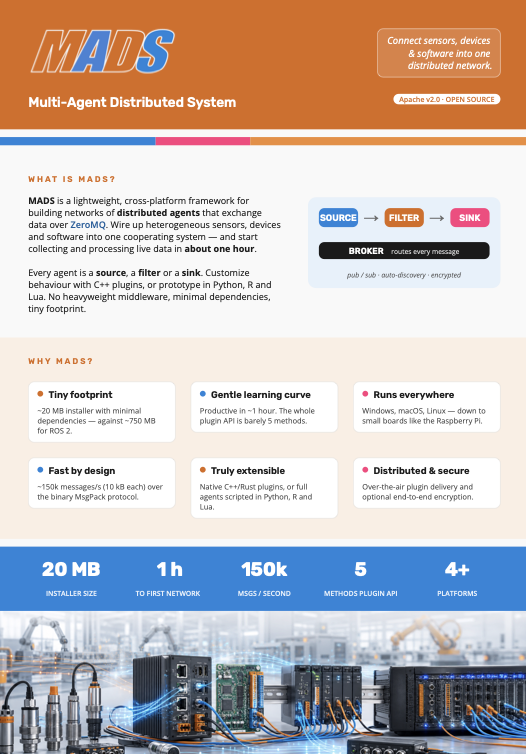

# What is it

::: {.columns}
::: {.column width="70%"}

MADS-NET is a simple framework for implementing a network of distributed agents that communicate with each other via a broker. It is designed to be **lightweight**, **modular**, and **easy to use**.

It is made by a main set of executables available in the [MADS tools collection](https://github.com/pbosetti/MADS) repo, which also provides installers for Linux, MacOS and Windows. 

It is a polyglot environment that can be extended in C++, C, Rust, Python, R, and Lua. It is also possible to interface with other languages via the `popen` interface.

The target audiences for MADS are **distributed measurement systems, IoT, process control systems, and robotics**.

:::
::: {.column width="30%"}

[{width=100% style="padding-left: 15px;"}](flyer.qmd)

:::
:::

::: aside
Always get the latest MADS installer on: 👉 [git.new/MADS](https://git.new/MADS) 👈

See [this guide](/guides/install.html) for installation instructions.
:::

# MADS design principle

The main requirements for MADS are:

* **ubiquity**: it should run on any platform, from embedded devices to high-end servers, regardless architecture and operating system
* **lightweight**: it should be possible to run on low-end devices with limited resources
* **modularity**: it should be possible to add new agents without recompiling the whole system
* **easy to use**: it should be easy to install and configure, and it should be possible to use it with a minimum API knowledge (**less than five** functions), using any common programming language
* **centralized**: configuration and custom code are stored in a single location 

What MADS delivers is a framework of tools and libraries that make easy and quick to implement a distributed agents system by completely separating:

* the networking operations: IPs, sockets, connectionsand re-connections: everything is automatic (but customizable if needed)
* the topology of the distributed system: defined in a single settings file (TOML format), and inspectable as a Graphviz dot file
* the business logic of each agent: only focus on the algorithms and the data, without having to care about networking, timings, addressing etc.

# Where to start

## The software collection

The MADS framework is Open Source (Apache 2.0 license) and is available on [GitHub](https://github.com/pbosetti/MADS). 

Beside the main framework there is a collection of ready to use agents, called *plugins*, that can be easily integrated into the MADS system and are available on <https://github.com/MADS-NET>.

::: {.callout-tip}

The VSCode extension [MADSCode](https://marketplace.visualstudio.com/items?itemName=MADS-Net.madscode) provdes useful features that simplify and accelerate custom agents development.

:::

## The dcumentation

The [Start here](start.qmd) page provides a quick overview of the MADS framework and its main features. It is a good starting point for new users.

Look into the [guides](/guides.html) section for more information on how to use the MADS tools collection, searchable and organized by topics.

The **Commands** section in the menu bar provides a complete list of the most important commands available in the MADS tools collection.

The **Concepts** section covers the main concepts behind MADS, including the architecture, the communication model, and the configuration files.

The **Presentations** section provides a set of interactive, web-based slides that can be used to present MADS to others.