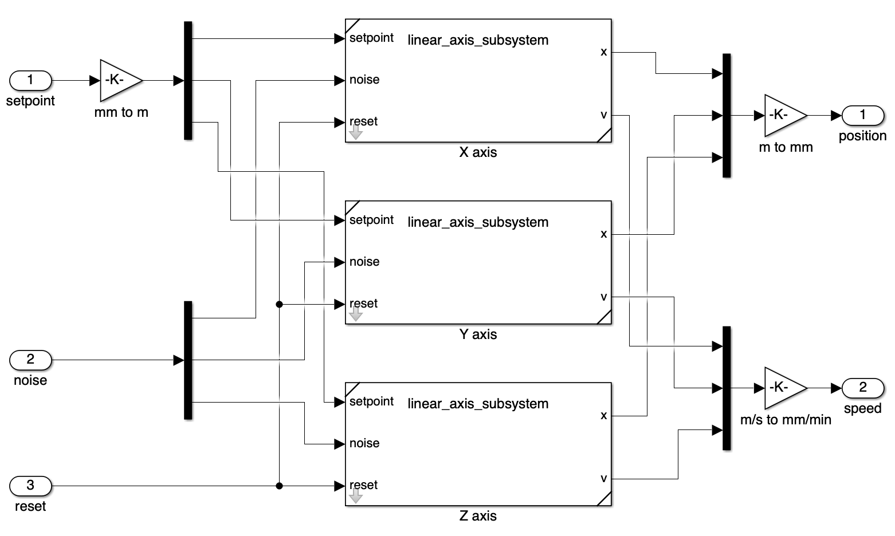

```{r setup}
#| echo: false
library(tidyverse)
```


##  Contents

* Requirements
* What is 
* Concepts
  * Broker-based networking
  * MADS Agents
    * Types of agents: source, filter, sink
    * Many ways to implement an agent
    * Data sources in Arduino
* Designing a network
* Deployment
* Advanced features


# Requirements

 is a polyglot environment: you might use C, C++, Rust, Python, R, Lua.

That said, **C++ is its core language**, and for using it you need a C++ environment

::: {.callout-warning}
### CMake version
More recent versions of CMake may not work with some of the MADS dependencies. Please st**ay on the tested 4.2.1 version**

:::

## Developing on Linux 

Core development is made in **CMake 4.x and Clang**, tested on Ubuntu 22.04 and 24.04

* IDE of choice is Visual Studio Code, with the **MADSCode** extension
* Be sure to have the proper packags installed and clang selected as compiler:

```bash
sudo apt update
sudo apt install clang cmake-curses-gui git libssl-dev
sudo update-alternatives --install /usr/bin/cc cc /usr/bin/clang 100
sudo update-alternatives --install /usr/bin/c++ c++ /usr/bin/clang++ 100
```

Then go to <https://git.new/mads>, download the latest `.deb` package and install with:

```bash
sudo dpkg -i Mads-v2.x.x-Linux-<platform>.deb
```


::: {.callout-warning}

Pick the proper `<platform>`: `x86_64` for Intel, `aarch64` for ARM machines

:::


## Developing on Windows 

Core development is made in **CMake 4.x and Visual Studio 2022**, tested on Windows 11

* IDE of choice is Visual Studio Code, with the **MADSCode** extension
* Visual Studio (Community Edition is fine) is only used as compiler, not as IDE
* When installing VS be sure to add C++ tools and CLI libraries
* Also install CMake 4.2.1 from [GitHub](https://github.com/Kitware/CMake/releases/tag/v4.2.1)

Then go to <https://git.new/mads>, download the latest `.exe` installer and follow the graphical install


## Developing on macOS 

Core development is made in **CMake 4.x and Clang**, tested on macOS 26 (Tahoe)

* IDE of choice is Visual Studio Code, with the **MADSCode** extension
* Apple Xcode tools must be installed (to have Clang working)
* Also install CMake 4.2.1 from [GitHub](https://github.com/Kitware/CMake/releases/tag/v4.2.1)

Then go to <https://git.new/mads>, download the latest `.dmg` installer and open it it. Then drag the `usr` folder into your home directory, and add the path `~/usr/local/bin` to your `PATH` environment variable and remove the unsafe attribute:

```sh
xattr -dr com.apple.quarantine ~/usr/local
```

::: {.callout-tip}
### How to change your `PATH`
* If your shell is `zsh`, then look [here](https://stackoverflow.com/questions/68605927/how-can-i-change-path-variable-in-zsh)
* If your shell is `bash`, then look [here](https://www.cyberciti.biz/faq/appleosx-bash-unix-change-set-path-environment-variable/)
:::


## Test that it works

Open a terminal (Developer PowerShell on Windows) and type:

```{bash}
#| echo: true
mads -h
```


::: {.callout-tip}

### If you get an error:

- be sure that your `PATH` variable contains the folder where the `mads` command has been installed
- be sure that your OS matches one of the versions above listed
- report back to <https://github.com/pbosetti/MADS/issues>, carefully describing your issue and configuration

:::


# What is ?

## Brief description

> MADS is a framework (i.e. a set of tools and libraries) to implement a collection of possibly distributed processes that collect, manipulate, store and present information

* based on IP connectivity (UDP and TCP)
* runs on Linux, macOS and Windows, on Intel and ARM architectures
* it is easily extensible with customized processes
* it is **centralized** and **broker-based**
* it is safe and industry-ready (**encrypted**)
* it is lightweight and easy to learn
* it is akin to ROS2, Apache Spark, Zenoh


## Common tasks: acquisition

You want to **aquire data/signals**:

* from microcontrollers via serial connection (e.g. Arduino)
* on microcontrollers with an ARM Linux OS (e.g. Arduino Uno Q, Raspberry Pi, Beaglebone)
* on microcontrollers with WiFi (Arduino Uno R4 WiFi only)
* from custom/vendor API in C/C++, Python or Rust


::: {.callout-note}

### Definition

MADS Processes that acquire and produce a data flow are called [source agents]{.bred}

:::


## Common tasks: manipulation

You want to **manipulate data/signals**:

* with custom algorithms implemented in C, C++, Python, Rust, R
* ML inference by models in **ONNX** format ([onnx.ai](https://onnx.ai))
* simulation models in **Functional Mock-Up Unit** ([FMU](https://fmi-standard.org)) format (exported from Simulink)

::: {.callout-note}

### Definition

MADS Processes that manipulate a data flow are called [filter agents]{.bgreen}

:::


## Common tasks: logging/presenting

You want to **consume or present data/signals**:

* storage/logging straight to [MongoDB databases](https://mongodb.com)
* logging to [HDF5](https://hdfgroup.org) format (for training ML models)
* realtime presentation via [Rerun.io](https://rerun.io)
* custom data consumers in C++, Rust, Python, R

::: {.callout-note}

### Definition

MADS Processes that consume a data flow (for logging or presenting, or acting on the field) are called [sink agents]{.bblue}

:::


# This is just a preview

The rest of this presentation will be available on Sep. 2026

---

# Concepts

Infrastructures for distributed systems

## Context

Distributed systems need **distributed information and computation**

::: {.columns}

::: {.column}
::: {.fragment}
### Challenges

* Reachability
* Topology
* Throughput
* Latency
* Scalability
* Security
:::
:::

::: {.column}
::: {.fragment}
### Solutions

* **REST/API** services: HTTP/HTTPS based, simple and proven, but N-to-1 only, [large overhead]{.bred}
* **Message-Queuing** protocols: flexible topology, [tiny overhead]{.bgreen}, often very low-level solutions
* **Mixed/custom solutions**: fragile and difficult to scale/integrate
:::
:::

:::


## Context: REST/REST-like solutions


::: {.columns}

::: {.column}

Characteristics:

- Only the server's URL/IP must be known
- Each edge is a `REQ/REP` [initiated by the client]{.bred}
- Node-to-node direct communication impossible, unless [all URLs/IPs are known]{.bred}
- Difficult to scale:
  - server resources
  - network topology


::: {.callout-note}
It is **information-consumption** oriented.
:::


:::

::: {.column}

```{dot}
digraph REST {
  graph [layout=neato]
  node[
    shape=square, 
    penwidth=2,
    fontname="Arial", 
    color=darkred, 
    style=filled, 
    fillcolor="#eeeeee"
  ]
  edge [fontname="Arial", len=1.3]

  S [label="Server", color=darkblue]

  n1 -> S
  n2 -> S
  n3 -> S
  n4 -> S
  n5 -> S
  S -> n5 [label="🔴", style="dashed"]

  n1 -> n2 [label="🔴", style="dashed"]
}
```

:::

:::


## Context: Message-Queuing protocols


::: {.columns}

::: {.column}
Advantages over REST:

* Broker-based networking
* wire protocol is lightweight (minimum overhead)
* only broker URL is needed 
* message `t1` can flow from `n1` to `n6`
* flexible topology
* highly scalable

::: {.callout-note}
It is **information-distribution** oriented.
:::


:::

::: {.column}
```{dot}
digraph mq {
  layout=neato;
  node[
    shape=square, 
    penwidth=2,
    fontname="Arial", 
    style=filled, 
    fillcolor="#eeeeee"
  ]
  edge [fontname="Arial", len=1.3]

  B [label=Broker, color=violet]

  // sources
  node [color=darkred]
  n1 -> B [label=t1]
  n2 -> B [label=t2]

  // filters
  node [color=darkgreen]
  n3 -> B [label=t3]
  B -> n3 [label=t1]
  n4 -> B [label=t4]
  B -> n4 [label=t2]

  // sinks
  node [color=darkblue]
  B -> n5 [label="t3,t4"]
  B -> n6 [label="t1"]

}
```
:::

:::


## Context: federation

```{dot}
//| fig-width: 8
//| fig-height: 5.0
//| out-height: "540px"
//| fig-align: center
digraph mq {
  graph [
    layout=dot,
    overlap=false,
    rankdir=LR
  ]
  node[
    shape=square, 
    penwidth=2,
    fontname="Arial", 
    style=filled, 
    fillcolor="#eeeeee"
  ]
  edge [fontname="Arial", len=1.3]

  subgraph N1 {
    B1 [label="Broker 1", color=violet]

    // sources
    node [color=darkred]
    n1
    n2
    n1 -> B1 [label=t1]
    n2 -> B1 [label=t2]

    // filters
    node [color=darkgreen]
    n3
    n4 [color=orange]
    n3 -> B1 [label=t3]
    B1 -> n3 [label=t1]
    n4 -> B1 [label=t14]
    B1 -> n4 [label="t1,t2,t3"]

    // sinks
    node [color=darkblue]
    n5
    n6
    B1 -> n5 [label="t2,t3"]
    B1 -> n6 [label="t1,t14"]
  }

  subgraph N2 {
    B2 [label="Broker 2", color=violet]

    // sources
    node [color=darkred]
    n14
    n14 -> B2 [label=t14]

    // filters
    node [color=darkgreen]
    n11
    n12
    n11 -> B2 [label=t11]
    B2 -> n11 [label="t1,t14"]
    n12 -> B2 [label=t15]
    B2 -> n12 [label=t3]

    // sinks
    node [color=darkblue]
    n13
    B2 -> n13 [label="t2,t14"]

  }
  
  n4 -> B2 [label="t1,t2,t3"]
  B2 -> n4 [label="t14"]

}
```

:::callout-important
### Definitions
Typically, nodes may act as [sources]{.bred} (produce information), [filters]{.bgreen} (elaborate), or [sinks]{.bblue} (consume information). The node `n4` acts as a **brigde** that federates two sub-networks

:::

## Context: alternatives

:::{.smaller}
|  | Pros | Cons | Proto. | Prod. | Learning |
|:-|:---------|:---------|:-:|:-:|:-:|
| **MQTT** | lightweight, proven | low-level, no fed'n | 🟠 | 🟢 |  |
| **ZeroMQ** | lightweight, very flexible, proven | low-level, fed'n is complex | 🟠 | 🟢 |  |
| [OPC-UA]{.bred} | powerful, industry-based, fed'n | heavy, complex, vendor-dependent, limited portability/integrability | 🔴 | 🟠🟢 |  |
| **Zenoh** | flexible and powerful, fed'n | high abstraction, low-level | 🟢 | 🟠 |  |
| **Apache Spark** | designed for high-loads & datacenters, fed'n | Java-based, limited integrability, unsuited to µC | 🔴 | 🟢 |  |
| **ROS2** | flexible, high level, feature rich | steep learning curve, robotics oriented, no fed'n | 🟢 | 🟢 |  |
|  | **easy**, ZeroMQ-based, portable, flexible, polyglot, fed'n | young (3 years) | 🟢🟢 | 🟠🟢 | **** |

:::callout-note
**Low-level** means a framework only/mostly taking care of data communication/distribution, where business logic must be implemented every time; **portability** means on different platforms/architectures; **integrability** means against existing solutions; **fed'n** means federation; learning curves  are subjective and qualitative.
:::
:::


##  Agents


::: {.columns}

::: {.column width="30%"}

{height="500px"}

:::

::: {.column width="70%"}

* A  network is made by one **broker** and many **agents**
* Agents are **processes**: whether they run on a single computer or on a multitude of networked computers is irrelevant (*except for throughput and latency*)
* Agents communicate each other via a TCP/IP network and **only** through the broker
* The broker is completely **transparent** and **data-agnostic**
* The process running the broker also distributes **agents settings** in REQ/REP fashion
* Information is channeled/routed/organized via **topics**, e.g. `measurements/force/X`
* An agent can **publish** on a topic and can **subscribe** to anther (to receive asynchronous updates)


:::

:::


##  Agents: types


::: {.columns}

::: {.column}

### Source agents

* **Acquire** information from the field:
  * sensors
  * peripherals (TTY, GUI)
  * other protocols
* **Publish** information on the MADS network under one or more **topics**
* Publishing may be timed or event-based

:::

::: {.column}

```{dot}
digraph source {
  rankdir=TD
  node[
    shape=rect, 
    penwidth=2,
    fontname="Arial", 
    style=filled, 
    fillcolor="#eeeeee"
  ]
  edge [fontname="Arial", len=1.3]

  node [color=darkgray]
  sensor
  peripheral
  node [color=darkred]
  agent

  broker [color=violet]

  edge [color=darkgray]
  sensor -> agent
  peripheral -> agent
  agent -> broker [label=t1, color=black]
}
```

:::

:::


##  Agents: types


::: {.columns}

::: {.column}

### Filter agents

* **Manipulate** information:
  * filters
  * controllers
  * gateways
* They **subscribe** to a topic, elabrate the received data, and **publish** back new data on a different topic
* Publishing is **mostly** event-based

:::

::: {.column}

```{dot}
digraph source {
  rankdir=TD
  node[
    shape=rect, 
    penwidth=2,
    fontname="Arial", 
    style=filled, 
    fillcolor="#eeeeee"
  ]
  edge [fontname="Arial", len=1.3]

  broker [color=violet]
  node [color=darkgreen]
  agent

  broker -> agent [label=t1, color=black]
  agent -> broker [label=t2]
}
```

:::

:::


##  Agents: types


::: {.columns}

::: {.column}

### Sink agents

* **Dispose** of information received by other agents via broker:
  * to GUI (plots, charts, dashboards)
  * to disk (JSON files, HDF5)
  * to **database** ([MongoDB](https://mongodb.com))
  * to other protocols
* Only deal with data coming from topics they are **subscribed** to
* Typically event-based

:::

::: {.column}

```{dot}
digraph source {
  rankdir=TD
  node[
    shape=rect, 
    penwidth=2,
    fontname="Arial", 
    style=filled, 
    fillcolor="#eeeeee"
  ]
  edge [fontname="Arial", len=1.3]

  broker [color=violet]

  node [color=darkblue]
  broker -> agent [label=t3]
}
```

:::

:::


## {background-iframe="MADS_Animation/MADSNetworkEmbed.html" background-interactive="true"}


## Incidentally: why MongoDB?

> MongoDB is a **schemaless, NoSQL** database server: it organizes data in **collections** of **JSON documents**


::: {.columns}

::: {.column}
### Advantages

* Data collection architectures may change (new agents, different data set-up)
* A schemaless database allows to carry on data collection even when its structure changes
* Still reasonably fast (20--250 kwrites/s)

:::

::: {.column}
### Limitations
* Dealing with non-consistent schema is demanded to downstream consumption (but doable!)
* SQL queries are easier than MongoDB queries (but AI helps here!)
* SQL servers can bear **higher workloads** (1.2x--1.5x)
  
:::

:::


## Data format: JSON


::: {.columns}

::: {.column}
* MADS agents exchange data as **JSON** objects, because of its flexibility
* Underlying C++ library is `nlohmann::json`
* Actual wire-format can be JSON (ASCII) or **MsgPack** (binary), per-agent negotiable
* Directly maps to what you log in MongoDB
* Directly maps to Python dictionaries
:::

::: {.column}

```{r bench_plot}
bench <- read_csv("benchmark.csv")

bench_summary <- bench %>%
  group_by(payload_size_kb, wire_format, compression) %>%
  summarise(
    payload_size_kb = first(payload_size_kb),
    wire_format = first(wire_format),
    compression = first(compression),
    mean_throughput = mean(throughput_ops),
    sd_throughput = sd(throughput_ops),
    ci_throughput = qt(0.975, df = n() - 1) * sd_throughput / sqrt(n()),
    .groups = "drop"
  ) %>%
  ungroup() %>%
  mutate(
    throughput_u = mean_throughput + ci_throughput,
    throughput_l = mean_throughput - ci_throughput
  )

K <- scales::trans_new(
  "K",
  transform = function(x) x / 1000,
  inverse = function(x) x * 1000,
  format = scales::label_number(scale = 1 / 1000, suffix = "k")
)

p <- bench_summary %>%
  ggplot(aes(x = payload_size_kb, y = mean_throughput, color = wire_format, linetype = compression)) +
  geom_line() +
  geom_point() +
  geom_errorbar(aes(ymin = throughput_l, ymax = throughput_u), width = 0.1) +
  scale_x_log10() +
  scale_y_continuous(transform = K) +
  labs(
    x = "Payload size (KB)",
    y = "Throughput (ops/sec)",
    color = "Wire format",
    linetype = "Compression"
  )
p
# ggsave("./figure_4.pdf", p, width = 6 * fig_scale, height = 3 * fig_scale)
# knitr::include_graphics("./figure_4.pdf")
```

:::

:::


##  Agents: implementation


::: {.callout-important}
###  Requirements
MADS has beed designed with requirements of **flexibility** and **easy extensibility**
:::

An agent can be implemented in a number of alternative ways:

* C++ process, linked to the `MadsCore` shared library (`#include <mads.hpp>`)
* C process, linked to the `MadsCore` shared library (`#include <mads_c.h>`)
* Python script [FFI](https://en.wikipedia.org/wiki/Foreign_function_interface)-linked to the `MadsCore` library (`import Mads`)
* C++ [plugin](https://en.wikipedia.org/wiki/Plug-in_(computing)), with minimal API surface (3 methods)
* Rust plugin, with minimal API surface (3 methods)
* Python plugin (a binary that loads a Python module at runtime)
* R plugin (a binary that loads a R script at runtime)
* Lua plugin (a binary that loads a Lua script at runtime)


##  Agents: implementation

The choice depends on personal knowledge/skill and task requirements:

| Method | Performance | Flexibility | Production-ready | Base install |
|:-------|:-:|:-:|:-:|:-:|
|C++ process|⭐️⭐️⭐️⭐️⭐️|⭐️⭐️⭐️⭐️|⭐️⭐️⭐️⭐️⭐️|✅|
|C process|⭐️⭐️⭐️⭐️⭐️|⭐️⭐️⭐️⭐️|⭐️⭐️⭐️⭐️|✅|
|Python script|⭐️|⭐️⭐️⭐️⭐️⭐️|⭐️⭐️|✅|
|C++ plugin|⭐️⭐️⭐️⭐️⭐️|⭐️⭐️⭐️|⭐️⭐️⭐️⭐️⭐️|✅|
|Rust plugin|⭐️⭐️⭐️⭐️⭐️|⭐️⭐️⭐️|⭐️⭐️⭐️⭐️⭐️|✅|
|Python plugin|⭐️⭐️|⭐️⭐️⭐️⭐️|⭐️⭐️|⛔️|
|R plugin|⭐️⭐️|⭐️⭐️⭐️⭐️|⭐️⭐️|⛔️|
|Lua plugin|⭐️⭐️⭐️|⭐️⭐️⭐️|⭐️⭐️|⛔️|

:::aside
⛔️ = see next slide
:::


## MADS-NET: a repository of pre-made agents

The [github.com/MADS-NET](https://github.com/MADS-NET) page provides a list of open source, ready available plugin and custom agents repositories for solving common tasks, which may be immediately useful, or provide a template on which to build upon:


::: {.columns}

::: {.column}
* Python/R/lua plugins
* HDF5 logging
* ML inference of ONNX models
* FMU plugins
* User interfaces
* JSON schema validation
* Arduino I/O
* and more
:::

::: {.column}
[](https://github.com/MADS-NET/python_agent)
[](https://github.com/MADS-NET/FMU_agent)
[](https://github.com/MADS-NET/onnx_agent)
[](https://github.com/MADS-NET/arduino_plugin)
:::

:::


## MADS-NET: a repository of pre-made agents

To install a custom agent from MADS-NET:


::: {.columns}

::: {.column}

### From source

* Clone the repo
* Configure and compile:\
  `cmake -Bbuild -GNinja`\
  `cmake --build build`
* Test from `build/toolname`
* Install (with `sudo` if needed):\
  `cmake --install build` 


:::

::: {.column}
### Pre-compiled (subsection)

* List available:\
  `mads package --list`
* Info on the one you want:\
  `mads package --info <package>`
* Install (with `sudo` if needed):\
  `mads package --install <package>`
:::

:::


::: {.callout-warning}
`mads package` is not a full-fledged package manager: it only supports the latest MADS version. **Build from source** if you stuble into problems
:::


##  Agents: Arduino-based

* Cheapest and fastest way to ingest field data into a MADS network
* Three possible, complementary solutions:
  * [`arduino.plugin`](https://github.com/MADS-NET/arduino_plugin) and a custom `.ino` sketch that prints a JSON string over serial --- **any Arduino**, but must be serial-port connected to an agent running on separate device
  * [`arduinoQ.plugin`](https://github.com/MADS-NET/arduinoQ_plugin), only works on an Arduino Uno Q: the agent runs on the CPU, a custom `.ino` on the MCU, they communicate via RPC --- **Uno Q only**, standalone
  * [`arduino_mads`](https://github.com/MADS-NET/arduino_mads): an Arduino-native library that provides low-level message passing to a MADS-network --- requires **Ethernet- or WiFi-equipped Arduino**, standalone, feature-limited


::: {.callout-tip}
The `arduino.plugin`, despite its name, works with **any micro** that can print on a serial port a JSON string
:::


# Commands and tools
 provides a number of command line tools to manage and monitor a network

## Common commands

* `mads broker` to start a broker
* `mads [source|filter|sink]` to load a C++ plugin
* `mads [rsource|rfilter|rsink]` to load a Rust plugin
* `mads plugin` to create a plugin template
* `mads logger` to log network traffic to MongoDB
* `mads echo` to watch network traffic
* `mads top` to monitor agents
* `mads package` to install a pre-made plugin from MADS-NET


## `mads broker`: centralized management tool

::: {.columns}

::: {.column width="50%"}
The broker does much more than just routing messages: it also provides a **centralized management** of the network

* ensures that all agents run on compatible versions of the MADS framework
* distributes to each agent (**when it starts**) its configuration from a local `mads.ini` file
* provides **Over the Air** (OTA) distribution of plugins binaries to remote agents
:::

::: {.column width="2%"}
:::

::: {.column width="48%"}
```toml
[agents] # common to all agents
frontend_address = "tcp://localhost:9090"
backend_address = "tcp://localhost:9091"
settings_address = "tcp://localhost:9092"
timecode_fps = 25
wire_format = "json"
compression = "auto"

[source]
pub_topic = "measurements/force/X"
attachment = "force_sensor.plugin" # OTA

[filter]
sub_topic = ["measurements"]
pub_topic = "filtered/force/X"

[sink]
sub_topic = "filtered"
```
:::

:::


## Agents and the `mads.ini` file

* A broker **advertises** its presence on the network, each broker in a virtual **room** with possibly different name (`mads` by default)
* Each agent needs the `mads.ini` file to start
* The agent searches for it in this order:
  1. a broker URI or a file path passed by the `--settings` command line option
  2. a **room** name if the `--room` command line option is used
  3. a broker running on `tcp://localhost:9092` (default)


::: {.callout-note}
Start order of broker and agents is irrelevant, as well it is restarting the broker while agents are running: they will automatically reconnect to the broker when it becomes available again

**The only way to reload the `mads.ini` file is to restart the agent**
:::


## GUI commands

Two commands provide GUIs to monitor and control a MADS network:

* `mads director`: coordinates the execution of multiple MADS tools on the same machine
* `mads chat`: reads and writes messages to the MADS network\
  (installed with `mads package --install mads-chat`)

::: {layout-ncol=2}
{width=500px}

{width=500px}
:::

## Utility commands

* `mads doctor`: help fixing MADS configuration issues
* `mads ini`: create a template `mads.ini` file
* `mads [record|play|bag]`: record and replay network traffic to a bag file (and inspects it)
* `mads up`: headless version of `mads director` (for remote control)
* `mads service`: install a MADS tool as a system service (Linux only)
* `mads update`: check for updates and provide packages URLs
* `mads fsm`: creates a [finite state machine](https://en.wikipedia.org/wiki/Finite-state_machine) agent template from a [Graphviz](https://graphviz.org/) scheme
* `mads federate`: launch a federation agent for connecting two MADS networks

## Common, general purpose plugins

* `mads sink rerunner.plugin`: a sink agent that sends data to [Rerun.io](https://rerun.io) for **realtime visualization**
* `mads sink validator.plugin`: a sink agent that validates JSON data against a schema
* `mads sink hdf5.plugin`: a sink agent that logs data to HDF5 files
* `mads [source|filter|sink] arduino.plugin`: a source/filter/sink agent that communicates with a microcontroller via serial port


::: {.callout-note}
### Python plugins
Python plugins are loaded by a dedicated `mads python` agent, which is installed with `mads package --install mads-python`. It is a **Python interpreter** that loads a Python module at runtime

To allow users to use their own Python version, the `mads python` agent **is not part** of the base MADS installation, but is available as a separate package from [MADS-NET/python_agent](https://github.com/MADS-NET/python_agent) to be compiled against your Python of choice

:::


## Anatomy of a plugin: C++

::: {.columns}

::: {.column .smaller}

```c++
class MySource : public Source<json> {
public:
  using Source::Source; // inherit constructors

  string kind() override { return PLUGIN_NAME; }

  return_type get_output(json &out, 
    vector<unsigned char> *blob = nullptr) override {
    out.clear();
    if (!_agent_id.empty()) out["agent_id"] = _agent_id;
    // FILL out with contents
    return return_type::success;
  }

  void set_params(const json &params) override {
    Source::set_params(params);
    _params["some_field"] = "default_value";
    _params.merge_patch(params); // merge with INI parameters
  }

  map<string, string> info() override { 
    return {{some_filed, _params["some_field"].get<string>()}};
  };

private:
  // some private fields
};
```

:::

::: {.column width="45%"}
* Inherit a base class (Source, Filter, Sink)
* Implement a few (3--4) methods:
  * `kind()`: returns the plugin name
  * `get_output()`: fills the output JSON object with data to be published
  * `set_params()`: sets parameters from the INI file
  * `info()`: returns a map of information about the plugin

:::

:::


## Anatomy of a plugin: Python module

::: {.columns}

::: {.column .smaller}

```python
import json

# Specify that this is a source agent
mads.agent_type = "source"

# Executed once at startup
def setup():
  print("[Python] Setting up source...")
  print("[Python] Parameters: " + json.dumps(mads.params))
  mads.state["n"] = 0

# executed in a loop, to produce data to be published
def get_output():
  mads.data = {"list": [1, 2, 3, 4], "n": mads.state["n"]}
  mads.state["n"] = mads.state["n"] + 1
  mads.data["processed"] = False
  return json.dumps(mads.data)
```

::: {.callout-warning}
`"source`" is the default agent type. If mandatory functions are not implemented, the agent fails to start
:::

:::

::: {.column width="45%"}
* It's a **module**, not a script
* Filters have `process()`, sinks have `deal_with_data()`
* Gets implicit access to the `mads` object:
  * `mads.params`: parameters from INI 
  * `mads.state`: a dictionary to store persistent state between calls
  * `mads.data`: the data to be published (as JSON string)
  * `mads.topic`: the topic of the last received message

:::

:::

## MADS message example


::: {.columns}

::: {.column width="50%"}
Publihed data is decorated by common fields (lines 8--14):

* `agent_id`: to distinguish different instances of the same agent
* `period`: the nominal time between two consecutive publications (in ms)
* `timestamp`: ISO 8601 timestamp of the publication
* `timecode`: seconds since the last midnight, rounded to the last `timecode_fps` frame rate (for **binning!**)

:::

::: {.column width="3%"}
:::

::: {.column width="47%"}
```json
{
  "my_data": {
    "id": 131,
    "payload": "rHIR]aDLI",
    "payload_length": 10,
    "values": [1, 2, 3, 4]
  },
  "agent_id": "",
  "hostname": "Fram-IV",
  "period": 100,
  "timecode": 49683.52,
  "timestamp": {
    "$date": "2026-08-06T13:48:03.540+0200"
  }
}
```


::: {.callout-important}
See [the guide](/manual/timing-scheduling.qmd) for timing and synchronization considerations
:::


:::

:::


# Design a  network

```{mermaid}
flowchart LR
    n1["`mads.ini file`"] --> n2["make graph"]
    n2 --> n3["complex?"]
    n2 --> n1
    n3 -- no --> n4["`prototype 
    plugin`"] 
    n3 -- yes -->n5["`make fsm 
    or API agent`"]
    n4 --> n6["fast?"]
    n6 -- yes --> n7["create service"]
    n6 -- no --> n8["template agent"]
    n8 --> n7
    n5 --> n7

    n1@{ shape: rect}
    n2@{ shape: proc}
    n3@{ shape: decision}
    n4@{ shape: proc}
    n5@{ shape: proc}
    n6@{ shape: decision}
    n7@{ shape: proc}
    n8@{ shape: proc}

```


## Design the network graph via `mads.ini`


::: {.columns}

::: {.column .smaller}
```toml

```


```{bash echo=FALSE, include=FALSE}
mads doctor --graph=mads.dot 
```
:::

::: {.column}
```{dot}

```
:::
:::


::: {.callout-note}
Agents with dangling topics have dashed borders. Solid edges are explicit topics, dashed are wildcard topics, dotted are implicit topics (same as agent's name)
:::


## Implement the agents

* If possible, reuse existing agents/plugins from base install or MADS-NET
* If not, implement a new agent:
  * if its logics fit the simple `source/filter/sink` model, create a plugin
  * if its logics are more complex, create a **finite state machine** agent or a **custom agent**\
    based on the MADS API
* Python plugins: start with examples in <https://github.com/MADS-NET/python_agent>
* C++ plugins: create a template with `mads plugin -t <source|filter|sink>`\
  and fill in the methods


::: {.callout-tip}
### Commands help:
Always use `mads <command> --help` to get a list of options and usage examples

If you are on macOS or Linux, you can also use `man mads-<command>` to get a more detailed description of the command and its options

:::


## Deployment

At the moment, only the Linux platform is expected to be used for **headless** devices (e.g. Raspberry Pi, Beaglebone, etc.) and for **production** deployments

On Linux, the `mads service` command allows to install a MADS agent as a **system service** (daemon), so that it starts automatically at boot time and can be managed with standard system commands. So, if your agent is launced as `mads source imu.plugin`, you can install it as a service with:

```sh
mads service mads_imu source imu.plugin 
```

This only previews the service file. **Check** if its OK, then install with:

```sh
sudo mads service mads_imu source imu.plugin 
sudo systemctl enable mads_imu.service
```

Then that agent will **start automatically** at boot time


# Advanced features

## FMI Interface

> **POV**: you have a Simulink model that you want to integrate into a MADS network, e.g. to simulate a physical system or a control algorithm (Digital Twin)


::: {.columns}

::: {.column width=60%}

* Be sure that your Simulink model has **Input and Output ports**
* Make it parametric as much as possible
* Save it as *model exchange* FMU v3.0
* The generated FMU can be loaded as a **filter agent** by the `mads fmu` agent
* The simulation time (TET) must be **smaller than the timestep**

:::

::: {.column width=40%}



:::

:::


::: {.callout-tip}
The list of simulation software that can export FMU v3.0 is available at <https://fmi-standard.org/tools/>
:::


## ONNX models 

> **POV**: you have a trained ML model and you want to integrate it into a MADS network, e.g. to perform inference on data collected from the field

* Quite similarly to the FMU case, there is the `mads onnx` agent that loads an ONNX model and runs inference on data received from the network
* it can be used both for as a **filter** and as a **source** agent:
  * an ONNX filter agent performs inference on data received from the network and publishes the results back to the network
  * an ONNX source agent performs inference on data received from a peripheral (e.g. a camera) and publishes the results back to the network
* The ONNX model must be **exported** from the training framework (PyTorch, TensorFlow, etc.) in **ONNX format** and must be **compatible** with the ONNX Runtime version used by the `mads onnx` agent (currently v1.26.0)


# ...and remember

Look at <https://mads-net.github.io> for documentation and guides!