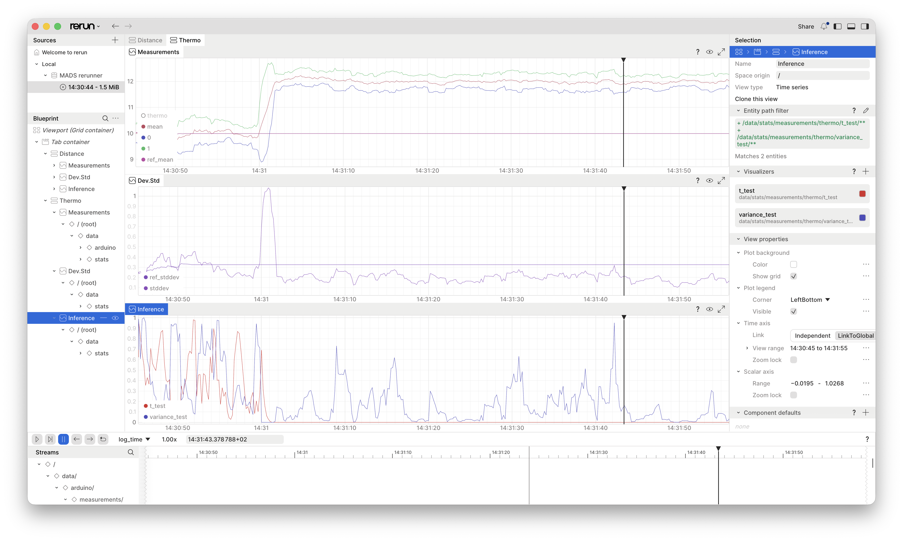

# Objective

We are building a simple application that uses the following agents:

* an agent that acquires analog data from a serial-port conected Arduino Uno R4
* an agent that processes the acquired data, computing some descriptive and inferential statistics
* an agent that visualizes the data and the computed statistics in [Rerun](htts://rerun.io){target="rerun"}
* an agent that logs the data and the computed statistics to a MongoDB database

# Arduino-side

We are using an Arduino Uno R4 board to acquire analog data from two QWIIC sensors: a temperature sensor and a distance sensor. The Arduino is programmed to read the sensors and send the data over the serial port to the MADS agent in JSON format.

For the sake of brevity, we're going to keep the Arduino part as simple as possible.

Launching the Arduino IDE, we can use the following code to read the sensors and send the data over the serial port:

```{.cpp filename="sensors.ino"}
/*
  __  __           _       _ _               _____        
 |  \/  | ___   __| |_   _| (_)_ __   ___   | ____|_  __  
 | |\/| |/ _ \ / _` | | | | | | '_ \ / _ \  |  _| \ \/ /  
 | |  | | (_) | (_| | |_| | | | | | | (_) | | |___ >  < _ 
 |_|  |_|\___/ \__,_|\__,_|_|_|_| |_|\___/  |_____/_/\_(_)
                                                          
Provides JSON output of the Modulino distance and temperature sensors.
*/

#include <Arduino_Modulino.h>
#include <ArduinoJson.h>

// Some constants for the Arduino sketch
#define DELAY 50UL
#define BAUD_RATE 115200
#define MAX_DISTANCE 1500

// Define global instances
JsonDocument doc;
ModulinoDistance Distance;
ModulinoThermo Thermo;

// Setup the system
void setup() {
  Serial.begin(BAUD_RATE);
  Serial.println("# Starting JSON reader");

  // Initialize Modulino library and sensors
  Modulino.begin();
  Distance.begin();
  Thermo.begin();
}


void loop() {
  // Populate the JSON document with temperature readings
  doc["measurements"]["thermo"] = Thermo.getTemperature();
  
  // If the distance sensor is available, use its reading; 
  // otherwise, simulate a reading oscillating around its maximum range
  if (Distance.available())
    doc["measurements"]["distance"] = Distance.get();
  else
    doc["measurements"]["distance"] = MAX_DISTANCE + random(-4,0);

  // Serialize the document to Serial port
  serializeJson(doc, Serial);
  Serial.println();

  // Delay the loop to avoid flooding the serial port
  delay(DELAY);
}
```


::: {.callout-tip}

If you don't have the sensors, you can simulate the output by reading the values of two open analog pins (A0 and A1) instead of the sensors. The Arduino code would look like this:

```{.cpp}
void loop() {
  // Simulate temperature reading
  doc["measurements"]["thermo"] = analogRead(A0) / 1023.0 * 100;

  // Simulate distance reading
  doc["measurements"]["distance"] = analogRead(A1) / 1023.0 * MAX_DISTANCE;

  // Serialize the document to Serial port
  serializeJson(doc, Serial);
  Serial.println();

  // Delay the loop to avoid flooding the serial port
  delay(DELAY);
}
```

Touching the analog pins with your fingers will change the readings, allowing you to test the MADS agent without the sensors.

:::

# -side

## Custom plugins

We must create two custom plugins:

1. the `stats.plugin`, which computes the running statistics on the incoming data (a **filter**)
2. the `dummy.plugin`, which is a **dummy agent** that simulates the acquisition of data from the Arduino board, in case you don't have the sensors or the board (a **source**)

To create a plugin, we use the `mads plugin` command, which creates a template code for the plugin, including the build harness and the CMake configuration. The commands are:

```{.bash code-line-numbers="false"}
mads plugin --type filter --dir Gorini stats
mads plugin --type source --dir Gorini dummy
```

The first command creates a filter plugin called `stats` in the `Gorini` directory, plus some additional files and the `CMakeLists.txt` file, while the second command creates a source plugin called `dummy` in the same directory, refusing to overwrite the files already created by the first command.

The `CMakeLists.txt` is ready and working, but it only compiles the **first plugin** (i.e., the `stats` plugin). To compile both plugins, we need to edit the `CMakeLists.txt` file and add the following lines close to the end, before the ection marked `# INSTALL`:

```{.cmake filename="CMakeLists.txt"}
add_plugin(dummy)
```


::: {.callout-important}

The `add_plugin(dummy)` CMake macro expects a file `src/dummy.cpp` and compiles it to produce the `dummy.plugin` shared library. 

:::


## The dummy plugin

Open the file in `src/dummy.cpp`. We need to include a couple of headers for generating random numbers and for measuring time:

```{.cpp filename="src/dummy.cpp"}
// other includes as needed here
#include <random>
#include <chrono>
```

Then we focus on the `DummyPlugin` class in `src/dummy.cpp`. Firstly, we need some private members for the random number generator and the distributions. At the end of the class, we set:

```{.cpp filename="src/dummy.cpp"}
private:
  array<normal_distribution<double>, 4> _dist;
  mt19937 _rng{20260816};
```


::: {.callout-important}

We are using the convention to prefix private members with an underscore `_` to distinguish them from public members and parameters.

:::

The `_dist` object is an array of four normal distributions, which we will use to generate random numbers for the distance and temperature sensors. The `_rng` object is a Mersenne Twister random number generator, seeded with a fixed value for reproducibility.

Now we can complete the four methods that define plugin behavior:

* `set_params()`: this method is called by the agent to set the parameters of the plugin upon start. We set the means and standard deviations of the distributions from the parameters.
* `get_output()`: this method is called by the agent to get the output of the plugin. We generate random numbers from the distributions and return them in a JSON object.
* `info()`: this method is called by the agent to get information about the plugin upon start. We return a map of strings with the means and standard deviations of the distributions.

Let's start with `set_params()`: We need 4 distributions, for in even minutes we're going to use the first two, and for odd minutes we're going to use the last two. This way we'll see a change in the output means and standard deviations every minute.

```{.cpp filename="src/dummy.cpp"}
  void set_params(const json &params) override {
    Source::set_params(params);

    // provide sensible defaults for the parameters by setting e.g.
    _params["means"] = {10.0, 10.0, 10.0, 12.0};
    _params["stds"] = {0.2, 0.3, 0.2, 0.2};

    // then merge the defaults with the actually provided parameters
    // params needs to be cast to json
    _params.merge_patch(params);

    if (_params["means"].size() != 4 || _params["stds"].size() != 4) {
      throw std::invalid_argument("means and stds must be arrays of size 4");
    }
    
    // initialize the distributions with the means and standard deviations
    _dist[0] = normal_distribution<double>(_params["means"][0], _params["stds"][0]);
    _dist[1] = normal_distribution<double>(_params["means"][1], _params["stds"][1]);
    _dist[2] = normal_distribution<double>(_params["means"][2], _params["stds"][2]);
    _dist[3] = normal_distribution<double>(_params["means"][3], _params["stds"][3]);
  }
```

Now to `get_output()`: its output (the message to be published) is the JSON object `out`, while the returned value is a `return_type` enum that indicates the success or failure of the method. The method generates random numbers from the distributions and returns them in a JSON object. 

```{.cpp filename="src/dummy.cpp"}
  return_type get_output(json &out, vector<unsigned char> *blob = nullptr) override {
    // reset the output JSON object
    out.clear();
    out["measurements"] = json::object();
    // get the current minutes value
    auto now = chrono::system_clock::now();
    auto minutes = chrono::duration_cast<chrono::minutes>(now.time_since_epoch()).count();
    // swap generator for odd and even minutes
    if (minutes % 2 == 0) {
      out["measurements"]["distance"] = _dist[0](_rng);
      out["measurements"]["thermo"] = _dist[1](_rng);
    } else {
      out["measurements"]["distance"] = _dist[2](_rng);
      out["measurements"]["thermo"] = _dist[3](_rng);
    }

    return return_type::success;
  }
```

Finally, it is useful to provide feedback to the user of actual parameter values used during initialization (`set_params()`). We can do so by implementing the `info()` method, which returns a map of strings with additional information about the plugin. This information is printed when the plugin is loaded by the agent.

```{.cpp filename="src/dummy.cpp"}
  map<string, string> info() override { 
    return { // A C++ map is a list of pairs
      {"means", _params["means"].dump()},
      {"stds", _params["stds"].dump()}
    };
  };
```


## The statistics plugin

This plugin is a tad more complex. To make things easier, we are going to use a third party library that provides descriptive and inferential statistics on running windows: [statisticalc](https://github.com/pbosetti/statisticalc){target="statisticalc"}. Take a moment to look at the repo to learn how to use it.

To be flexible, we want the plugin to dynamically select which measurements it has to operate on. We can do that by provinding it with a list of **keypaths**. A keypath is a string that identifies a field in a JSON object, using the [JSON pointer](https://datatracker.ietf.org/doc/html/rfc6901) syntax. For example, the keypath `/measurements/thermo` identifies the `thermo` field in the `measurements` object. So, if we want to compute statistics on the `thermo` and `distance` measurements, we can provide the following keypaths:

```{.cpp}
{"/measurements/thermo", "/measurements/distance"}
```

The frst step is to add it to the CMake harness. Open the `CMakeLists.txt` file and add the following in the `# DEPENDENCIES` section:

```{.cmake filename="CMakeLists.txt"}
FetchContent_Declare(statisticalc
  GIT_REPOSITORY https://github.com/pbosetti/statisticalc.git
  GIT_TAG        HEAD
  GIT_SHALLOW    TRUE
  EXCLUDE_FROM_ALL
)
FetchContent_MakeAvailable(statisticalc)
```
then be sure to link it to the `stats` target: change the `add_plugin(stats)` line to:

```{.cmake filename="CMakeLists.txt"}
add_plugin(stats LIBS statisticalc::statisticalc)
```

Now the `src/stats.cpp` file: This is a **filter plugin**, and we have to implement a different set of methods. First of all, let's load the necessary header, from the statisticalc library:

```{.cpp filename="src/stats.cpp"}
#include <statisticalc/statisticalc.hpp>
using statisticalc::Alternative;
using statisticalc::RunningStats;
```

As for the private members, we two sets of running statistics: one for the reference (training set), one for the moving window. Each set can potentially contain multiple running statistics, for different measurement types (e.g., temperature, distance, etc.). We use a `std::map` to store the running statistics, with the key being the JSON pointer to the measurement in the input JSON object:

```{.cpp filename="src/stats.cpp"}
private:
  map<string, statisticalc::RunningStats<double>> _reference_stats; 
  map<string, statisticalc::RunningStats<double>> _running_stats; 
```

Now the settings: `set_params()` and `info()`.

```{.cpp filename="src/stats.cpp"}
void set_params(const json &params) override {
    Filter::set_params(params);

    // provide sensible defaults for the parameters by setting e.g.
    _params["keypaths"] = {"/measurements/distance"};
    _params["reference_samples"] = 100;
    _params["window_size"] = 10;

    _params.merge_patch(params);

    if (_params["keypaths"].size() == 0) {
      throw std::invalid_argument("keypaths must be a non-empty array");
    }
    // Initialize the running statistics for each keypath with the specified window size
    for (const auto &keypath : _params["keypaths"]) {
      _running_stats[keypath.get<string>()] = RunningStats<double>(_params["window_size"].get<int>());
    }
    for (const auto &keypath : _params["keypaths"]) {
      _reference_stats[keypath.get<string>()] = RunningStats<double>(_params["reference_samples"].get<int>());
    }
  }

  // Implement this method if you want to provide additional information
  map<string, string> info() override { 
    return {
      {"keypaths", _params["keypaths"].dump()},
      {"reference_samples", to_string(_params["reference_samples"].get<int>())},
      {"window_size", to_string(_params["window_size"].get<int>())}
    };
  };
```

Being this a **filter** plugin, we need to implement the `load_data()` and `process()` methods. The first one is called by the agent to load the data from the input JSON object, while the second one is called to process the data and produce the output JSON object. The operation is split, so that the agent may gracefully fail upon receiving data and before processing.

```{.cpp filename="src/stats.cpp"}
  return_type load_data(json const &input, string topic = "", vector<unsigned char> const *blob = nullptr) override {
    for (auto &pair : _running_stats) {
      json::json_pointer keypath(pair.first);
      if (!_reference_stats[pair.first].full()) {
        _reference_stats[pair.first] << input[keypath].get<double>();
      }
      pair.second << input[keypath].get<double>();
    }
    return return_type::success;
  }
```

Finally, the `process()` method computes the statistics on the running window and returns them in the output JSON object. It also computes the confidence interval for the mean, and performs a t-test and a variance test against the reference statistics.

```{.cpp filename="src/stats.cpp"}
  return_type process(json &out, vector<unsigned char> *blob = nullptr) override {
    out.clear();

    // load the data as necessary and set the fields of the json out variable
    for (auto &pair : _running_stats) {
      json::json_pointer keypath(pair.first);
      out[keypath]["mean"] = pair.second.mean();
      out[keypath]["median"] = pair.second.median();
      out[keypath]["stddev"] = pair.second.stddev();
      auto ci = pair.second.mean_ci(0.999);
      out[keypath]["mean_ci"] = {ci.lower, ci.upper};
      auto t_test = pair.second.t_test(_reference_stats[pair.first].mean());
      out[keypath]["t_test"] = t_test.p_value;
      auto f_test = pair.second.variance_test(_reference_stats[pair.first].variance());
      out[keypath]["variance_test"] = f_test.p_value;
      out[keypath]["ref_mean"] = _reference_stats[pair.first].mean();
      out[keypath]["ref_stddev"] = _reference_stats[pair.first].stddev();
    }

    return return_type::success;
  }
```

## Compile the plugins

To compile the plugins, run the following commands from the `Gorini` directory:

```{.bash code-line-numbers="false"}
cmake -Bbuild -GNinja
cmake --build build -j8
```

Now in the `build` folder you have the `stats.plugin` and `dummy.plugin` shared libraries, which can be loaded by the MADS `filter` and `source` agents, respectively.

::: {.callout-note}
### Test exectuables
At the end of each source file there is a `main()` function. It is used to compile a standalone executable for testing purposes. We are not doing that here, but you can use it to test the plugins independently of the MADS framework. In a typical case, the `main()` function is used to test the plugin class with some sample data, and print the output to the console.

On compile, CMake creates a `stats` and a `dummy` executable in the `build` folder beside their `.plugin` counterparts, which can be run to test the plugins. On macOS only, the the `.plugin` file itself is executable, so you can launch it alone to test the class with the content of the `main()` function. On Linux and Windows, you need to run the `stats` and `dummy` executables instead.
:::


# Running the network

## The `mads.ini` file

To run the network of agents, we need to create a custom `mads.ini` configuration file, which will be loaded by the broker and distributed to each agent.

The INI file must have a section for each agent (i.e. a `[stats]` section for the `stats` agent, a `[dummy]` section for the `dummy` agent, etc.), and each agent section may customize the parameters loaded by the plugin in the `set_params()` method.

The easiest way to create a template `mads ini` is with the `mads ini` command:

```{.bash code-line-numbers="false"}
mads ini -o mads.ini
```

Then open the file, remove the sections we don't need and add the sections for the two custom agents:

```{.toml filename="mads.ini"}
[agents]
# Settings shared by all agents
frontend_address = "tcp://localhost:9090"
backend_address = "tcp://localhost:9091"
settings_address = "tcp://localhost:9092"
timecode_fps = 25

[broker]
frontend_address = "tcp://*:9090"
backend_address = "tcp://*:9091"
settings_address = "tcp://*:9092"
prefer_loopback_for_local_services = true

[logger]
mongo_uri = "mongodb://localhost:27017"
mongo_db = "gorini"
sub_topic = ["stats", "arduino"]

[arduino]
# Check this value!
port = "/dev/cu.usbmodemB43A4536D2A02"

[dummy]
pub_topic = "arduino"
period = 100
means = [10.0, 10.0, 10.0, 12.0]
stds = [0.2, 0.3, 0.2, 0.2]

[stats]
sub_topic = ["arduino"]
keypaths = ["/measurements/distance", "/measurements/thermo"]
reference_samples = 50
window_size = 10

[rerunner]
sub_topic = ["arduino", "stats"]
```

The INI file can be used to preview a graph of the network we are defining: run the command `mads doctor -s mads.ini --graph=mads.dot` and you get a Graphviz DOT file that renders as:

```{dot}
digraph mads {
  rankdir=LR;
  node [shape=record, fontname="monospace", fontsize=8];
  edge [fontname="monospace", fontsize=8];

  arduino  [label="arduino"];
  dummy    [label="dummy", color=darkred];
  logger   [label="logger|{stats\larduino\l}", color=darkblue];
  rerunner [label="rerunner|{arduino\lstats\l}", color=darkblue];
  stats    [label="stats|{arduino\l}", color=darkblue];

  arduino -> logger [label="arduino", color=gray50, fontcolor=gray50];
  arduino -> rerunner [label="arduino", color=gray50, fontcolor=gray50];
  arduino -> stats [label="arduino", color=gray50, fontcolor=gray50];
  dummy   -> logger [label="arduino"];
  dummy   -> rerunner [label="arduino"];
  dummy   -> stats [label="arduino"];
  stats   -> logger [label="stats", color=gray50, fontcolor=gray50];
  stats   -> rerunner [label="stats", color=gray50, fontcolor=gray50];
}
```

Note that both the `arduino` and the `dummy` agents publish to the same topic, so they both provide data to the `stats` filter, which eventually feeds the `logger` and the `rerunner` sink agents.

Now open **four terminals** and run the following commands in each of them:

* Terminal 1: `mads broker`: this launches the broker, which is the central hub of the network
* Terminal 2: `mads source build/dummy.plugin`: this launches the dummy source agent
* Terminal 3: `mads filter build/stats.plugin`: this launches the stats filter agent
* Terminal 4: `mads echo arduino`: this shows the data published on the `arduino` topic, which is the output of the dummy source agent

In the last terminal you'll see a stream of JSON objects, each containing the `distance` and `thermo` measurements. More metadata (including timestamp) is added by the MADS framework, but the important part is the `measurements` object, which contains the two measurements.

```{=html}
<script src="https://asciinema.org/a/geaEzWbwA0RA2nGk.js" id="asciicast-geaEzWbwA0RA2nGk" async="true"></script>
```


::: {.callout-tip}

Look at the guide [here](/guides/director.qmd) for how to use the `mads director` GUI to launch the network of agents and monitor their status in a single window. Also look at the help for its terminal counterpart, the `mads up` command.

:::


To stop any of the agents, press `Ctrl+C` in the terminal where it is running. To stop the broker, type "q" in its terminal. Note that the order in which the agents and the broker are launched **is irrelevant**.

If you stop the `mads echo` comand and launch `mads echo stats`, you'll see the output of the `stats` filter agent, which contains the computed statistics for each measurement.


## Acquiring real data with the Arduino plugin

the **MADS-Net** repository provides a pre-compiled plugin for routing serial port data to the MADS network. The plugin can be easily installed with:

```{.bash code-line-numbers="false"}
mads package --install arduino.plugin
```


::: {.callout-warning}
Prepend the command with `sudo` on Linux and macOS if you have installed MADS in a system path.
:::

Then you can replace the dummy source agent with the proper Arduino source:

```{.bash code-line-numbers="false"}
mads source arduino.plugin
```

If you have both agents, `dummy` and `arduino`, running at the same time, they will both publish to the same topic, so you can see the data from both sources in the `mads echo arduino` terminal, but you **won't be able to distinguish their output**. To avoid confusion, stop the `dummy` agent before launching the `arduino` agent.


## Logging the data

Logging the data to a database is a powerful tool to store process data to be later used to train models, perform statistical analysis, or simply to keep a record of the process. The MADS framework provides a `logger` agent that can log data to a MongoDB database.

Once you have a MongoDB database running on yur local machine, you can start logging just by launching `mads logger` in a terninal.

Look at [the logging guide](/guides/mongodb.qmd) for more information on how to configure the logger agent and how to use it to log data to a MongoDB database.


## Realtime plotting with Rerun

The last step is to visualize the data and the computed statistics in realtime. The MADS framework provides a `rerunner` agent that can send data to the [Rerun](https://rerun.io){target="rerun"} visualization tool.

How to use rerun is documented in the [dedicated guide](/guides/rerun.qmd). In short, you need to install the Rerun application on your machine, install the `rerun.plugin`, and properly configure the `[rerunner]` section in the `mads.ini` file.

### Install Rerun

The easiest way to install Rerun is via `pip`, preferably in a virtual environment (conda or venv).

The command is:

```{.bash code-line-numbers="false"}
python3 -mvenv .venv
pip install rerun-sdk==0.35.0
source .venv/bin/activate
```


::: {.callout-warning}
Remember to activate the virtual environment in every terminal you want to run the `rerunner` agent, otherwise it won't find the `rerun` package.
:::

If the command `rerun` opens a GUI window, you are ready to go. If not, check the [Rerun installation guide](https://rerun.io/docs/getting-started) for your platform.


### Install the `rerun.plugin` and configure the `mads.ini` file

As for the `arduino.plugin`:

```{.bash code-line-numbers="false"}
mads package --install rerun.plugin
```

then edit the `[rerunner]` section in the `mads.ini` as follows:

```{.toml filename="mads.ini"}
[rerunner]
sub_topic = ["arduino", "stats"]
keypaths = [
  "/arduino/measurements/distance", 
  "/stats/measurements/distance", 
  "/stats/measurements/distance/mean", 
  "/stats/measurements/distance/ref_mean", 
  "/stats/measurements/distance/mean_ci/0", 
  "/stats/measurements/distance/mean_ci/1",
  "/stats/measurements/distance/stddev",
  "/stats/measurements/distance/ref_stddev",
  "/stats/measurements/distance/t_test",
  "/stats/measurements/distance/variance_test",
  "/arduino/measurements/thermo", 
  "/stats/measurements/thermo",
  "/stats/measurements/thermo/mean", 
  "/stats/measurements/thermo/ref_mean", 
  "/stats/measurements/thermo/mean_ci/0", 
  "/stats/measurements/thermo/mean_ci/1",
  "/stats/measurements/thermo/stddev",
  "/stats/measurements/thermo/ref_stddev",
  "/stats/measurements/thermo/t_test",
  "/stats/measurements/thermo/variance_test"
]
```

In this case, the `keypaths` array tells the plugin which fields to send to the Rerun application. The `sub_topic` array tells the plugin which topics to subscribe to. In this case, we are subscribing to both the `arduino` and the `stats` topics, so we can visualize both the raw data and the computed statistics. Note that each keypath must be prefixed with the topic name (e.g., `/arduino/` or `/stats/`), otherwise the plugin won't find the field in the input JSON object.

Note that if the broker is running, it will automatically reload the `mads.ini` file when you save it, although running agents shall be restarted to force reload their settings.

Now you can launch the `rerunner` agent and see the data in the Rerun application:

```{.bash code-line-numbers="false"}
mads sink rerun.plugin
```

Confguring the Rerun application is beyond the scope of this exercise, but you can find some examples in the [Rerun documentation](https://rerun.io/docs/concepts/visualization/blueprints).



Rerun supports *blueprints*:, files that define the layout and the visualization of the data. You can create your own blueprints and load them in the Rerun application to customize the visualization. The blueprint used above can be downloaded [here](arduino.rbl){target="_blank"}.